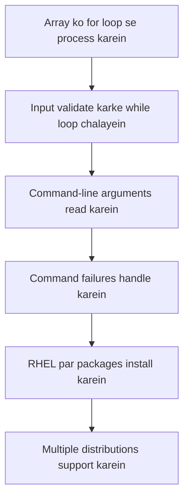
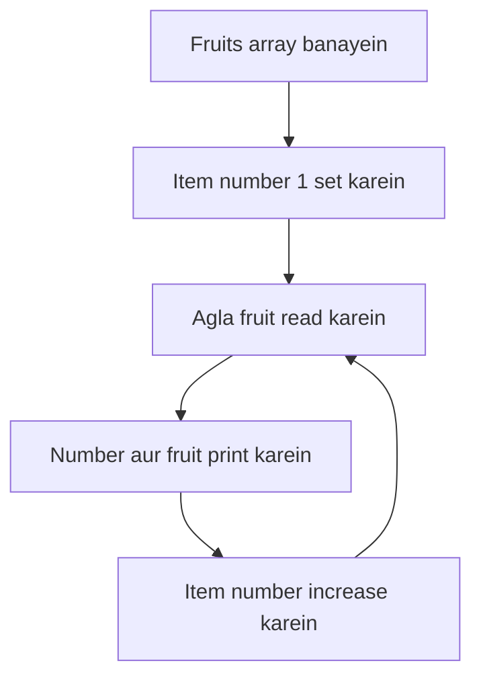
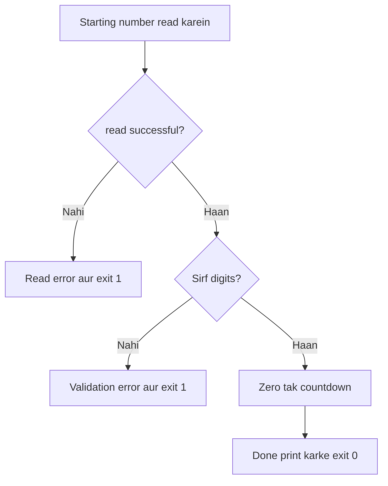
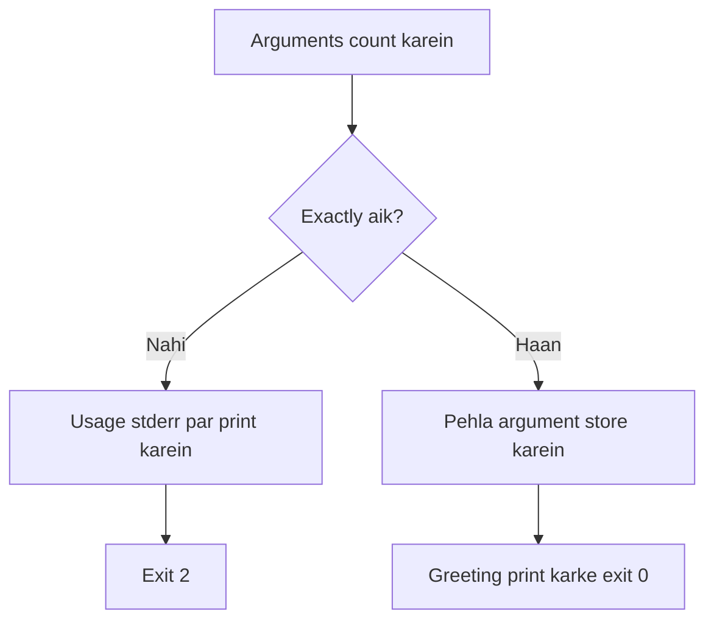
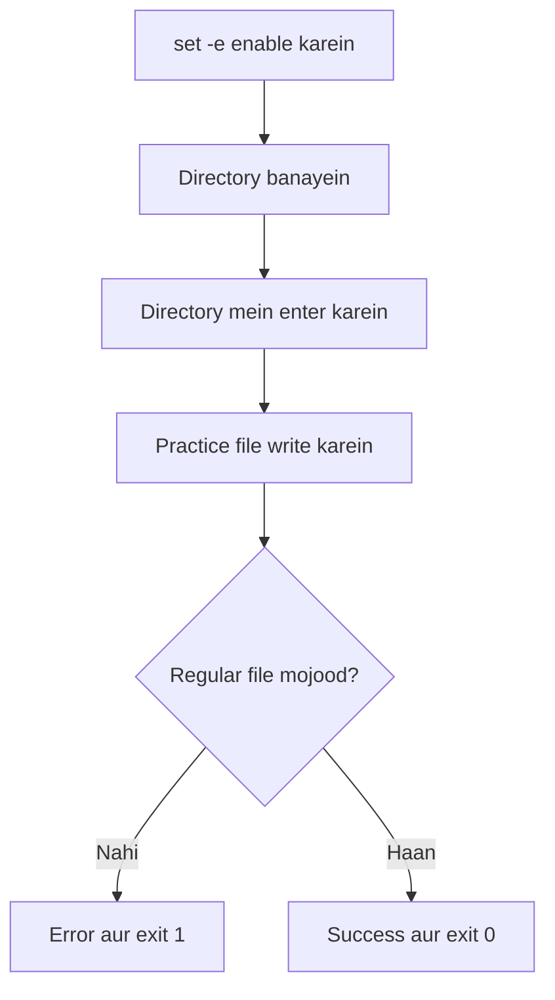
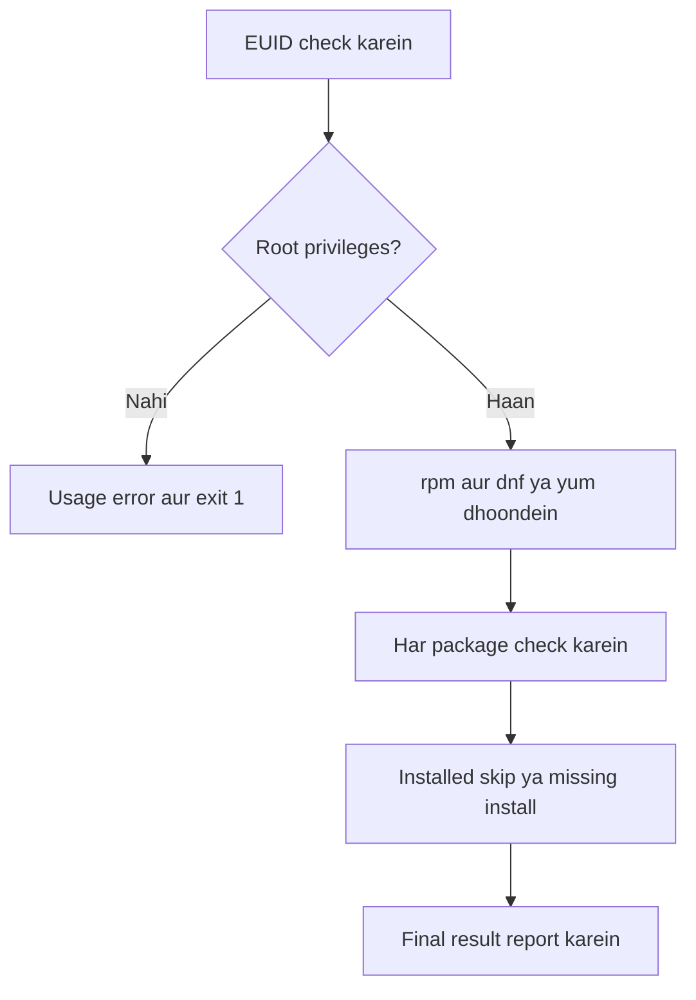
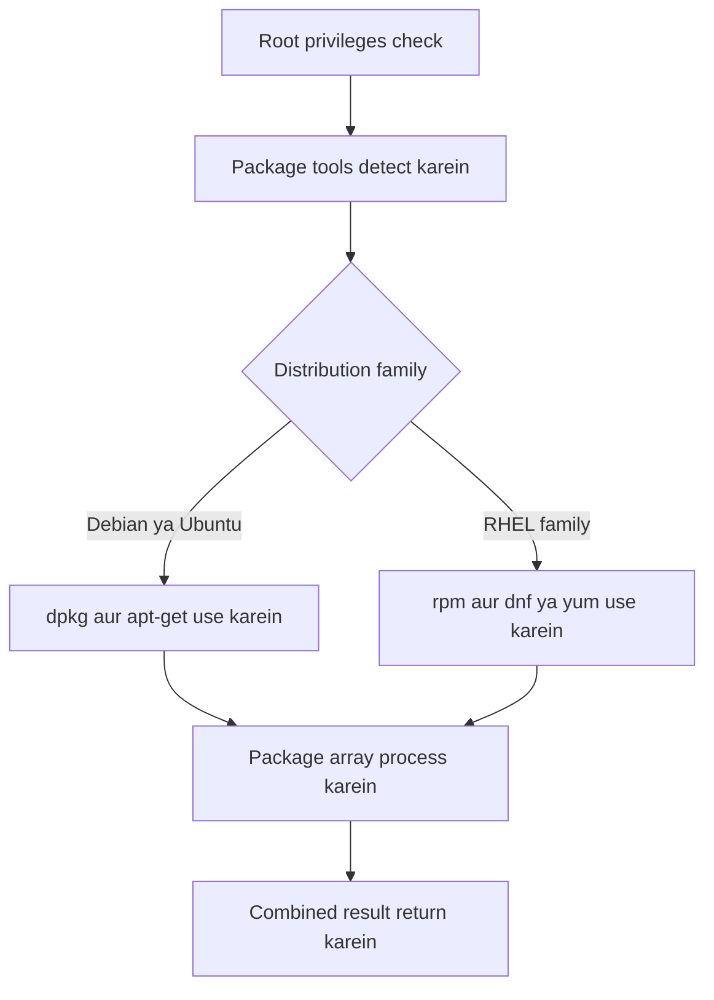
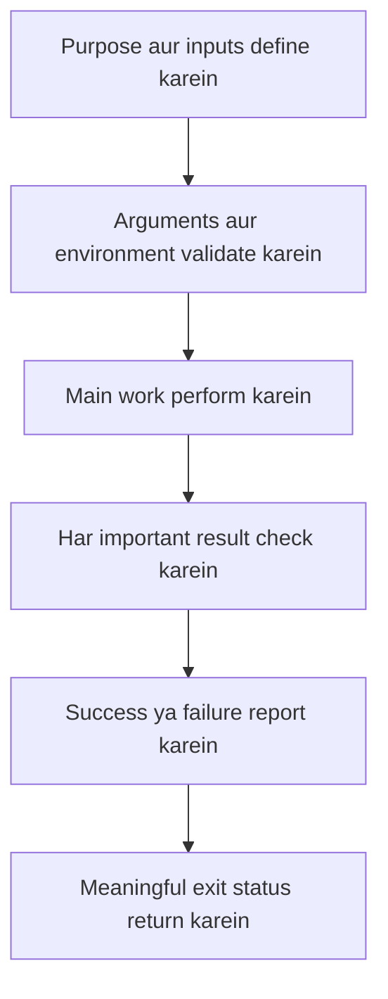

# Task 02 — Bash Scripting Complete Solutions (Roman Urdu)

## Loops, Arguments, Input Validation, Error Handling aur Package Installation

Yeh guide Task 02 ke tamam aath scripts ki complete, beginner-friendly solutions provide karti hai. Har solution mein code, script flow, important commands, conditions, error handling, exit codes aur practical examples shamil hain.

## Table of Contents

1. [Solution files](#1-solution-files)
2. [Preparation](#2-preparation)
3. [Task 1A — Fruit list](#3-task-1a--fruit-list)
4. [Task 1B — 1 se 10 tak counting](#4-task-1b--1-se-10-tak-counting)
5. [Task 2 — Validated countdown](#5-task-2--validated-countdown)
6. [Task 3A — Greeting argument](#6-task-3a--greeting-argument)
7. [Task 3B — Arguments demonstration](#7-task-3b--arguments-demonstration)
8. [Task 4 — Safe file-creation workflow](#8-task-4--safe-file-creation-workflow)
9. [Task 5A — RHEL-only package installer](#9-task-5a--rhel-only-package-installer)
10. [Task 5B — Cross-distribution package installer](#10-task-5b--cross-distribution-package-installer)
11. [Tamam solutions ki testing](#11-tamam-solutions-ki-testing)
12. [Exit-code reference](#12-exit-code-reference)
13. [Aham learning points](#13-aham-learning-points)

---

## 1. Solution Files

Complete directory mein yeh files hongi:

```text
task-02/
├── for_loop.sh
├── count.sh
├── countdown.sh
├── greet.sh
├── args_demo.sh
├── safe_script.sh
├── install_packages_rhel.sh
└── install_packages.sh
```

### Overall learning flow



---

## 2. Preparation

Working directory aur script files banayein:

```bash
mkdir -p task-02
cd task-02

touch for_loop.sh count.sh countdown.sh greet.sh args_demo.sh
touch safe_script.sh install_packages_rhel.sh install_packages.sh
```

Code add karne ke baad tamam scripts ko executable banayein:

```bash
chmod +x ./*.sh
```

Permissions check karein:

```bash
ls -l ./*.sh
```

Executable script ki permissions mein `x` nazar aata hai:

```text
-rwxr-xr-x 1 user user ... for_loop.sh
```

---

## 3. Task 1A — Fruit List

### File: `for_loop.sh`

```bash
#!/bin/bash

# Title: Numbered Fruit List
# Purpose: Print five fruits with item numbers.

fruits=("apple" "banana" "mango" "orange" "red cherry")
item_number=1

for fruit in "${fruits[@]}"
do
    echo "Item $item_number: $fruit"
    item_number=$((item_number + 1))
done

exit 0
```

### Script flow



Final array element process hone ke baad loop khud end ho jata hai.

### Block-by-block explanation

#### 1. Array banana

```bash
fruits=("apple" "banana" "mango" "orange" "red cherry")
```

Yeh paanch elements ki Bash array banata hai. `"red cherry"` ko quotes mein rakhne se dono words aik hi array element rehte hain.

#### 2. Counter start karna

```bash
item_number=1
```

Pehla fruit item `1` hona chahiye, is liye counter `1` se start hota hai.

#### 3. Array par safely loop chalana

```bash
for fruit in "${fruits[@]}"
```

`"${fruits[@]}"` har array element ko separately expand karta hai aur element ke andar spaces preserve karta hai. Is liye `red cherry` aik hi fruit rehta hai.

#### 4. Print aur increment

```bash
echo "Item $item_number: $fruit"
item_number=$((item_number + 1))
```

Pehli line current item number aur fruit print karti hai. Doosri line next cycle se pehle counter mein `1` add karti hai.

### Script run karein

```bash
./for_loop.sh
```

Output:

```text
Item 1: apple
Item 2: banana
Item 3: mango
Item 4: orange
Item 5: red cherry
```

### Aham lesson

| Expansion | Result |
|---|---|
| `"${fruits[@]}"` | Har array element ko separately preserve karta hai |
| `${fruits[@]}` | `red cherry` ko do words mein split kar sakta hai |

`exit 0` batata hai ke list successfully complete hui.

---

## 4. Task 1B — 1 se 10 Tak Counting

### File: `count.sh`

```bash
#!/bin/bash

# Title: Count from 1 to 10
# Purpose: Demonstrate a for loop with a numeric brace range.

for number in {1..10}
do
    echo "$number"
done

echo "Counting complete."
exit 0
```

### Explanation

```bash
{1..10}
```

Bash loop chalane se pehle brace range ko expand karta hai:

```text
1 2 3 4 5 6 7 8 9 10
```

Har cycle mein next value `number` variable ko milti hai aur `echo` usay print karta hai.

### Script run karein

```bash
./count.sh
```

Output:

```text
1
2
3
4
5
6
7
8
9
10
Counting complete.
```

### Flow summary

| Step | Action |
|---:|---|
| 1 | Bash `{1..10}` ko expand karta hai |
| 2 | Next value `number` ko assign hoti hai |
| 3 | `echo` current value print karta hai |
| 4 | `10` process hone tak loop repeat hota hai |
| 5 | Completion message print hota hai |
| 6 | Script status `0` ke saath exit karti hai |

---

## 5. Task 2 — Validated Countdown

### File: `countdown.sh`

```bash
#!/bin/bash

# Title: Validated Countdown
# Purpose: Count from a user-supplied non-negative whole number to zero.

if ! read -r -p "Enter a starting number: " starting_number; then
    echo "Error: could not read the input." >&2
    exit 1
fi

if [[ ! "$starting_number" =~ ^[0-9]+$ ]]; then
    echo "Error: enter a non-negative whole number." >&2
    exit 1
fi

# The 10# prefix treats values such as 08 as decimal numbers.
count=$((10#$starting_number))

while (( count >= 0 ))
do
    echo "$count"
    count=$((count - 1))
done

echo "Done!"
exit 0
```

### Script flow



### Step-by-step explanation

#### 1. Input read karna aur failure detect karna

```bash
if ! read -r -p "Enter a starting number: " starting_number; then
```

| Part | Meaning |
|---|---|
| `read` | Standard input se aik line read karta hai |
| `-r` | Backslash ko escape character banne se rokta hai |
| `-p` | Input se pehle prompt display karta hai |
| `starting_number` | User input store karta hai |
| `!` | Command ka result reverse karta hai |

Agar user `Ctrl+D` se end-of-file bheje to `read` fail hota hai. `!` failure ko true condition bana deta hai aur error block run hota hai.

#### 2. Input format validate karna

```bash
if [[ ! "$starting_number" =~ ^[0-9]+$ ]]; then
```

| Symbol | Meaning |
|---|---|
| `^` | Value ka start |
| `[0-9]` | Koi aik digit |
| `+` | Aik ya zyada digits |
| `$` | Value ka end |
| `!` | Regex match na ho to block run kare |

Yeh validation `0`, `3`, `08` aur `100` accept karti hai. Empty input, `-3`, `2.5` aur `apple` reject hotay hain.

#### 3. Decimal conversion

```bash
count=$((10#$starting_number))
```

`10#` Bash ko batata hai ke value base 10 mein hai. Is ke baghair leading zero wali value, jaise `08`, invalid octal samjhi ja sakti hai.

#### 4. Countdown loop

```bash
while (( count >= 0 ))
```

Jab tak `count` zero ya us se bara hai, loop chalta rehta hai.

```bash
count=$((count - 1))
```

Har cycle mein value aik kam hoti hai.

### Successful example

```bash
./countdown.sh
```

```text
Enter a starting number: 3
3
2
1
0
Done!
```

Exit status:

```bash
echo "$?"
```

```text
0
```

### Invalid-input example

```text
Enter a starting number: apple
Error: enter a non-negative whole number.
```

Exit status: `1`.

---

## 6. Task 3A — Greeting Argument

### File: `greet.sh`

```bash
#!/bin/bash

# Title: Command-Line Greeting
# Purpose: Greet exactly one supplied name.

if (( $# != 1 )); then
    echo "Usage: $0 NAME" >&2
    exit 2
fi

name="$1"

echo "Hello, $name!"
exit 0
```

### Script flow



### Explanation

```bash
(( $# != 1 ))
```

- `$#` total command-line arguments ki tadaad rakhta hai.
- `!= 1` ka matlab “aik ke barabar nahi” hai.
- Zero ya multiple arguments par usage block run hota hai.

```bash
echo "Usage: $0 NAME" >&2
```

- `$0` script ka woh naam ya path hai jis se usay run kiya gaya.
- `>&2` message ko standard error par bhejta hai.

`exit 2` is project mein incorrect command usage ko represent karta hai.

### Correct examples

```bash
./greet.sh Khalid
```

```text
Hello, Khalid!
```

Multi-word name ko aik argument rakhne ke liye quotes use karein:

```bash
./greet.sh "Ali Khan"
```

```text
Hello, Ali Khan!
```

### Incorrect examples

```bash
./greet.sh
```

```text
Usage: ./greet.sh NAME
```

```bash
./greet.sh Ali Khan
```

Doosri command do arguments deti hai, is liye status `2` return hota hai. Multi-word name ke liye quotes zaroor use karein.

---

## 7. Task 3B — Arguments Demonstration

### File: `args_demo.sh`

```bash
#!/bin/bash

# Title: Argument Demonstration
# Purpose: Display the script name, argument count, and every argument.

echo "Script name: $0"
echo "Argument count: $#"

printf 'All arguments:'
printf ' %s' "$@"
printf '\n'

argument_number=1

for argument in "$@"
do
    echo "Argument $argument_number: $argument"
    argument_number=$((argument_number + 1))
done

exit 0
```

### Special parameters

| Parameter | Meaning |
|---|---|
| `$0` | Script ka naam ya path |
| `$1` | Pehla argument |
| `$2` | Doosra argument |
| `$#` | Total arguments ki tadaad |
| `"$@"` | Tamam arguments, individually preserved |

### `printf` kyun use hua?

```bash
printf ' %s' "$@"
```

`printf` har argument ke liye format dobara apply karta hai. `"$@"` quoted hone ki wajah se `red cherry` aik argument rehta hai.

### Script run karein

```bash
./args_demo.sh apple banana "red cherry"
```

Output:

```text
Script name: ./args_demo.sh
Argument count: 3
All arguments: apple banana red cherry
Argument 1: apple
Argument 2: banana
Argument 3: red cherry
```

### Argument flow

| Command-line value | Positional parameter |
|---|---|
| `apple` | `$1` |
| `banana` | `$2` |
| `red cherry` | `$3` |
| Total | `$#` ki value `3` |

Yeh script zero ya zyada arguments accept karti hai, is liye empty argument list error nahi hai.

---

## 8. Task 4 — Safe File-Creation Workflow

### File: `safe_script.sh`

```bash
#!/bin/bash

# Title: Safe File-Creation Workflow
# Purpose: Create a directory and practice file with explicit error handling.

set -e

work_directory="/tmp/devops-test"
practice_file="$work_directory/practice.txt"

mkdir -p -- "$work_directory" || {
    echo "Error: could not create $work_directory." >&2
    exit 1
}

echo "Directory ready: $work_directory"

cd -- "$work_directory" || {
    echo "Error: could not enter $work_directory." >&2
    exit 1
}

printf '%s\n' "DevOps practice" > "$practice_file" || {
    echo "Error: could not write to $practice_file." >&2
    exit 1
}

if [[ ! -f "$practice_file" ]]; then
    echo "Error: regular file was not created: $practice_file" >&2
    exit 1
fi

echo "File created: $practice_file"
echo "Task completed successfully."
exit 0
```

### Script flow



### Important commands

#### `set -e`

```bash
set -e
```

Yeh Bash ko kehta hai ke unhandled simple command failure par script terminate kar de. Yeh safety aid hai, magar complete error-handling system nahi.

#### `mkdir -p --`

```bash
mkdir -p -- "$work_directory"
```

| Part | Purpose |
|---|---|
| `mkdir` | Directory banata hai |
| `-p` | Existing directory accept aur missing parents create karta hai |
| `--` | Command options ka end mark karta hai |
| `"$work_directory"` | Path ko aik quoted argument rakhta hai |

#### `||` error block

```bash
command || {
    echo "Error" >&2
    exit 1
}
```

`||` ka right side sirf tab run hota hai jab left-side command fail kare. Braces multiple error-handling commands ko aik group banati hain.

`||` se pehle wali command test ho rahi hoti hai, is liye `set -e` foran exit nahi karta. Error block ke andar explicit `exit 1` script ko intentionally stop karta hai.

#### File write karna

```bash
printf '%s\n' "DevOps practice" > "$practice_file"
```

`>` target file ko writing ke liye open karta hai. Missing file create hoti hai aur existing file ka purana content replace ho jata hai.

#### Regular file verify karna

```bash
[[ -f "$practice_file" ]]
```

`-f` tab successful hota hai jab path mojood ho aur regular file ho.

### Script run karein

```bash
./safe_script.sh
```

Expected output:

```text
Directory ready: /tmp/devops-test
File created: /tmp/devops-test/practice.txt
Task completed successfully.
```

Result verify karein:

```bash
cat /tmp/devops-test/practice.txt
```

```text
DevOps practice
```

Script status `1` ke saath exit karti hai agar directory create, directory enter, file write, ya regular-file verification fail ho jaye.

---

## 9. Task 5A — RHEL-Only Package Installer

### File: `install_packages_rhel.sh`

```bash
#!/bin/bash

# Title: RHEL-Family Package Installer
# Purpose: Install nginx, curl, and wget when missing.
# Usage: sudo ./install_packages_rhel.sh

if (( EUID != 0 )); then
    echo "Error: run this script with sudo." >&2
    echo "Usage: sudo $0" >&2
    exit 1
fi

if ! command -v rpm >/dev/null 2>&1; then
    echo "Error: rpm is not available; this is not a supported RHEL-family system." >&2
    exit 1
fi

if command -v dnf >/dev/null 2>&1; then
    package_manager="dnf"
    install_command=(dnf install -y --)
elif command -v yum >/dev/null 2>&1; then
    package_manager="yum"
    install_command=(yum install -y --)
else
    echo "Error: neither dnf nor yum is available." >&2
    exit 1
fi

packages=("nginx" "curl" "wget")
installation_failed=0

echo "Selected package manager: $package_manager"

for package in "${packages[@]}"
do
    if rpm -q "$package" >/dev/null 2>&1; then
        echo "[INSTALLED] $package is already installed."
        continue
    fi

    echo "[MISSING] Installing $package..."

    if "${install_command[@]}" "$package"; then
        echo "[SUCCESS] $package was installed."
    else
        echo "[ERROR] $package installation failed." >&2
        installation_failed=1
    fi
done

if (( installation_failed != 0 )); then
    echo "Error: one or more packages could not be installed." >&2
    exit 1
fi

echo "All packages are installed or were already present."
exit 0
```

### Installer flow



### Step-by-step explanation

#### 1. Administrative privileges check

```bash
if (( EUID != 0 )); then
```

`EUID` Bash ka effective user ID hai. Root ka effective user ID `0` hota hai. Package installation ke liye administrative privileges chahiye hoti hain.

Correct command:

```bash
sudo ./install_packages_rhel.sh
```

#### 2. Command availability check

```bash
command -v rpm >/dev/null 2>&1
```

| Component | Meaning |
|---|---|
| `command -v rpm` | Check karta hai ke Bash `rpm` locate kar sakta hai |
| `>/dev/null` | Normal output discard karta hai |
| `2>&1` | Error output ko bhi usi destination par bhejta hai |

Yahan output nahi, sirf command status important hai:

- `0`: command mil gaya
- Nonzero: command nahi mila

#### 3. `dnf` ya `yum` select karna

```bash
install_command=(dnf install -y --)
```

Installation command array mein store ki gayi hai. Har component separate argument rehta hai.

```bash
"${install_command[@]}" "$package"
```

Yeh command array ko safely expand karke current package name add karta hai.

#### 4. Package state check

```bash
rpm -q "$package" >/dev/null 2>&1
```

- Status `0`: package installed hai.
- Nonzero: package installed nahi ya query fail hui.

Is controlled lab mein fixed valid package names hain, is liye nonzero result ko missing package treat kiya gaya hai.

#### 5. Installed package skip karna

```bash
continue
```

`continue` current loop cycle ko end karke next package par chala jata hai.

#### 6. Individual failure record karna

```bash
installation_failed=1
```

Script pehli failed installation par stop nahi hoti. Failure flag set karti hai aur baqi packages check karti hai. End par yeh flag final exit status decide karta hai.

### Root-check failure

```bash
./install_packages_rhel.sh
```

```text
Error: run this script with sudo.
Usage: sudo ./install_packages_rhel.sh
```

Exit status: `1`.

### Representative successful output

```text
Selected package manager: dnf
[INSTALLED] curl is already installed.
[MISSING] Installing nginx...
[SUCCESS] nginx was installed.
[MISSING] Installing wget...
[SUCCESS] wget was installed.
All packages are installed or were already present.
```

### `dnf update` kyun shamil nahi?

Yeh task named packages install karta hai; full system upgrade iska maqsad nahi. `dnf install` system cache policy ke mutabiq zaroorat par metadata refresh karta hai. Full update aik separate administrative change hai jis ke liye planning chahiye.

---

## 10. Task 5B — Cross-Distribution Package Installer

### File: `install_packages.sh`

```bash
#!/bin/bash

# Title: Cross-Distribution Package Installer
# Purpose: Install nginx, curl, and wget on Debian/Ubuntu or RHEL-family systems.
# Usage: sudo ./install_packages.sh

if (( EUID != 0 )); then
    echo "Error: run this script with sudo." >&2
    echo "Usage: sudo $0" >&2
    exit 1
fi

packages=("nginx" "curl" "wget")
installation_failed=0

if command -v dpkg >/dev/null 2>&1 &&
   command -v apt-get >/dev/null 2>&1; then

    distribution_family="Debian/Ubuntu"
    package_manager="apt-get"

    is_installed()
    {
        dpkg -s "$1" >/dev/null 2>&1
    }

    install_package()
    {
        DEBIAN_FRONTEND=noninteractive apt-get install -y -- "$1"
    }

elif command -v rpm >/dev/null 2>&1; then

    distribution_family="RHEL"

    if command -v dnf >/dev/null 2>&1; then
        package_manager="dnf"
        install_command=(dnf install -y --)
    elif command -v yum >/dev/null 2>&1; then
        package_manager="yum"
        install_command=(yum install -y --)
    else
        echo "Error: neither dnf nor yum is available." >&2
        exit 1
    fi

    is_installed()
    {
        rpm -q "$1" >/dev/null 2>&1
    }

    install_package()
    {
        "${install_command[@]}" "$1"
    }

else
    echo "Error: supported package-management tools were not found." >&2
    exit 1
fi

echo "Detected system family: $distribution_family"
echo "Selected package manager: $package_manager"

for package in "${packages[@]}"
do
    if is_installed "$package"; then
        echo "[INSTALLED] $package is already installed."
        continue
    fi

    echo "[MISSING] Installing $package..."

    if install_package "$package"; then
        echo "[SUCCESS] $package was installed."
    else
        echo "[ERROR] $package installation failed." >&2
        installation_failed=1
    fi
done

if (( installation_failed != 0 )); then
    echo "Error: one or more packages could not be installed." >&2
    exit 1
fi

echo "All packages are installed or were already present."
exit 0
```

### Cross-distribution flow



### Functions yahan kyun useful hain?

Dono system families ka high-level workflow same hai:

1. Package installed hai ya nahi check karein.
2. Missing ho to install karein.
3. Result print karein.

Underlying commands different hain, lekin dono implementations ko same function names diye gaye hain:

```bash
is_installed "$package"
install_package "$package"
```

Is wajah se main loop ko har package ke liye separate Debian aur RHEL branches nahi likhni partin.

### Debian/Ubuntu branch

```bash
dpkg -s "$1" >/dev/null 2>&1
```

`dpkg -s` local package database query karta hai.

```bash
DEBIAN_FRONTEND=noninteractive apt-get install -y -- "$1"
```

| Part | Purpose |
|---|---|
| `DEBIAN_FRONTEND=noninteractive` | Mumkin had tak interactive configuration questions rokta hai |
| `apt-get install` | Package install karta hai |
| `-y` | Confirmation ka jawab automatically yes deta hai |
| `--` | Command options ka end mark karta hai |
| `"$1"` | Function ka pehla argument package name ke taur par deta hai |

Fresh Debian/Ubuntu lab mein agar local package index missing ya stale ho to pehle run karein:

```bash
sudo apt-get update
```

`apt-get update` metadata refresh karta hai; installed packages ko upgrade nahi karta.

### RHEL branch

RHEL branch `install_packages_rhel.sh` wala design reuse karti hai:

- `rpm -q` package state check karta hai.
- `dnf` preferred hai.
- `yum` fallback hai.
- Selected installation command array mein store hoti hai.

### Function positional parameters

Function ke andar `$1` us function ko diya gaya pehla argument hota hai—zaroori nahi ke woh entire script ka `$1` bhi ho.

```bash
is_installed "$package"
```

Agar `package="curl"` ho, to `is_installed` function ke andar `$1` ki value `curl` hogi.

### Failure ke baad main loop kyun continue karta hai?

Pehle failed package par stop karne se baqi packages unchecked reh jate. Is liye script:

1. Failure record karti hai.
2. Baqi list process karti hai.
3. End par combined failure status return karti hai.

Batch automation mein yeh approach useful hai kyun ke output har attempted item ka result dikhata hai.

### Ubuntu example

```bash
sudo apt-get update
sudo ./install_packages.sh
```

Representative output:

```text
Detected system family: Debian/Ubuntu
Selected package manager: apt-get
[INSTALLED] curl is already installed.
[MISSING] Installing nginx...
[SUCCESS] nginx was installed.
[INSTALLED] wget is already installed.
All packages are installed or were already present.
```

### Rocky Linux ya AlmaLinux example

```bash
sudo ./install_packages.sh
```

Representative output:

```text
Detected system family: RHEL
Selected package manager: dnf
[INSTALLED] curl is already installed.
[MISSING] Installing nginx...
[SUCCESS] nginx was installed.
[INSTALLED] wget is already installed.
All packages are installed or were already present.
```

### Package-installer exit paths

| Situation | Exit status |
|---|---:|
| Root privileges ke baghair run hua | `1` |
| Required package tools available nahi | `1` |
| Kam az kam aik installation fail hui | `1` |
| Tamam packages installed ya pehle se present | `0` |

### Safety notes

- Package installers sirf approved lab system par run karein.
- Long-lived root shell kholne ki bajaye `sudo ./script.sh` use karein.
- Execution se pehle package list review karein.
- Simple installer mein planning ke baghair `dnf update`, `yum update` ya `apt-get upgrade` add na karein.
- Package names aur repositories distributions ke darmiyan different ho sakte hain.

---

## 11. Tamam Solutions ki Testing

### Step 1: Bash syntax check

```bash
for script in ./*.sh
do
    if bash -n "$script"; then
        echo "[SYNTAX OK] $script"
    else
        echo "[SYNTAX ERROR] $script" >&2
        exit 1
    fi
done
```

Example output:

```text
[SYNTAX OK] ./args_demo.sh
[SYNTAX OK] ./count.sh
[SYNTAX OK] ./countdown.sh
[SYNTAX OK] ./for_loop.sh
[SYNTAX OK] ./greet.sh
[SYNTAX OK] ./install_packages.sh
[SYNTAX OK] ./install_packages_rhel.sh
[SYNTAX OK] ./safe_script.sh
```

`bash -n` script execute kiye baghair Bash syntax check karta hai.

### Step 2: Non-privileged scripts run karein

```bash
./for_loop.sh
./count.sh
./countdown.sh
./greet.sh Khalid
./args_demo.sh apple banana "red cherry"
./safe_script.sh
```

### Step 3: Expected failures test karein

| Test | Expected result |
|---|---|
| `countdown.sh` mein `apple` enter karein | Validation error; status `1` |
| Countdown prompt par `Ctrl+D` press karein | Read error; status `1` |
| `greet.sh` name ke baghair run karein | Usage error; status `2` |
| `greet.sh Ali Khan` quotes ke baghair run karein | Usage error; status `2` |
| Installer ko `sudo` ke baghair run karein | Privilege error; status `1` |

Status foran check karein:

```bash
echo "$?"
```

### Step 4: Script trace karein

```bash
bash -x ./countdown.sh
```

`bash -x` expanded commands ko execution ke waqt display karta hai. Learning aur troubleshooting mein useful hai, lekin variables ka sensitive data show kar sakta hai.

### Step 5: Package installers sirf lab mein run karein

RHEL-family system:

```bash
sudo ./install_packages_rhel.sh
```

Supported Debian/Ubuntu ya RHEL-family system:

```bash
sudo ./install_packages.sh
```

---

## 12. Exit-Code Reference

### Is project ke exit codes

| Code | Project mein meaning | Example |
|---:|---|---|
| `0` | Successful completion | Loop complete ya packages ready |
| `1` | Runtime, validation, privilege ya installation failure | Invalid countdown input ya failed installation |
| `2` | Incorrect command-line usage | `greet.sh` ko wrong argument count dena |

### Command status aur script exit ka farq

Har command status return karti hai. Script `if`, `!`, `&&` ya `||` se status check karke decide kar sakti hai ke continue karna hai ya `exit` use karna hai.

```bash
if command; then
    echo "Command succeeded"
else
    status=$?
    echo "Command failed with status $status" >&2
fi
```

### `$?` ka important rule

Jis command ka status chahiye, us ke foran baad `$?` save karein:

```bash
command
status=$?
```

Agar beech mein doosra command run ho gaya to `$?` overwrite ho jayega.

---

## 13. Aham Learning Points

### Teen main lessons

1. **Data ko quote aur list elements ko preserve karein.** `"$variable"`, `"$@"` aur `"${array[@]}"` use karein taake spaces aik value ko ghalti se multiple words mein split na karein.
2. **Processing se pehle validate karein.** Main work start karne se pehle input format, argument count, required commands aur privileges check karein.
3. **Failures ko design ka hissa samjhein.** Errors ko `stderr` par bhejein, meaningful exit statuses use karein aur success sirf required commands ke successful hone ke baad print karein.

### Complete script-design flow



### Final checklist

- [ ] Har script `#!/bin/bash` se start hoti hai.
- [ ] Data wali variables quoted hain.
- [ ] Arrays `"${array[@]}"` use karti hain.
- [ ] Argument loops `"$@"` use karte hain.
- [ ] Arithmetic se pehle user input validate hota hai.
- [ ] Error messages `>&2` use karti hain.
- [ ] Incorrect usage status `2` return karti hai.
- [ ] Runtime failures nonzero status return karti hain.
- [ ] Success message sirf successful operation ke baad print hota hai.
- [ ] Package installers `EUID` aur required tools verify karte hain.
- [ ] Tamam scripts `bash -n` pass karti hain.
- [ ] Package installation sirf approved lab mein test hoti hai.
