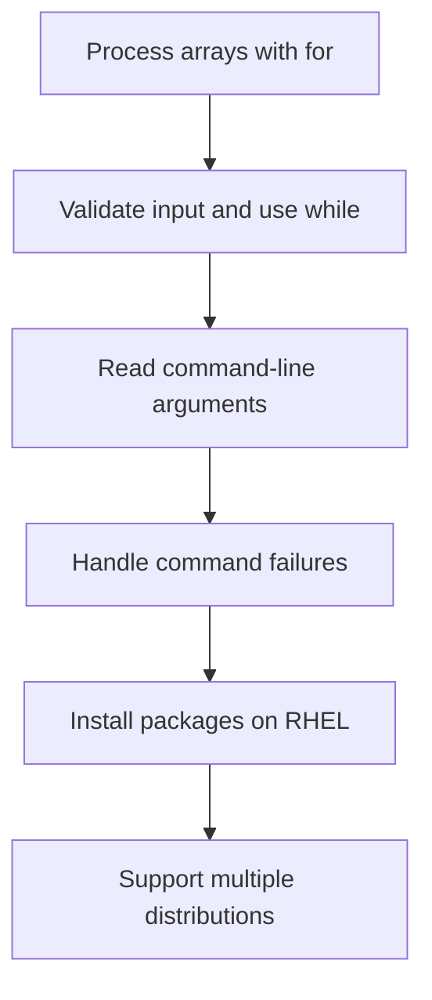
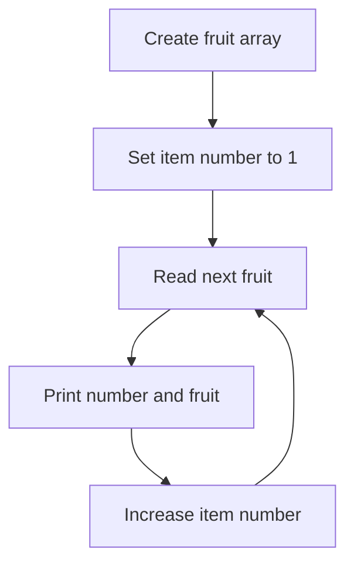
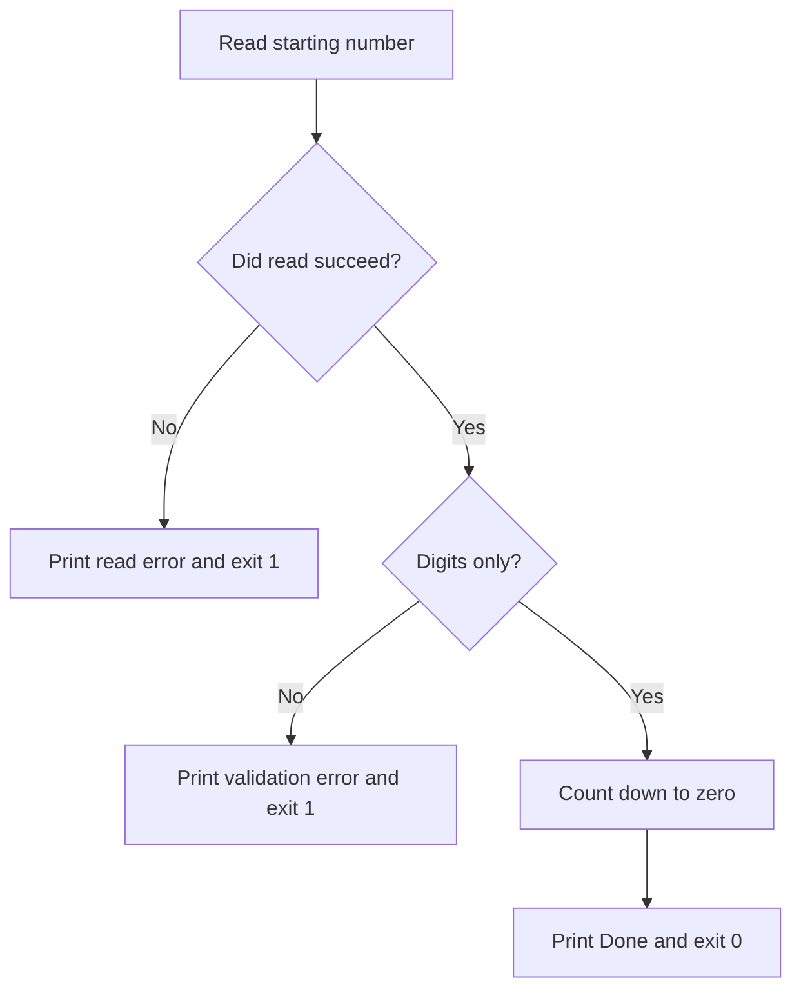
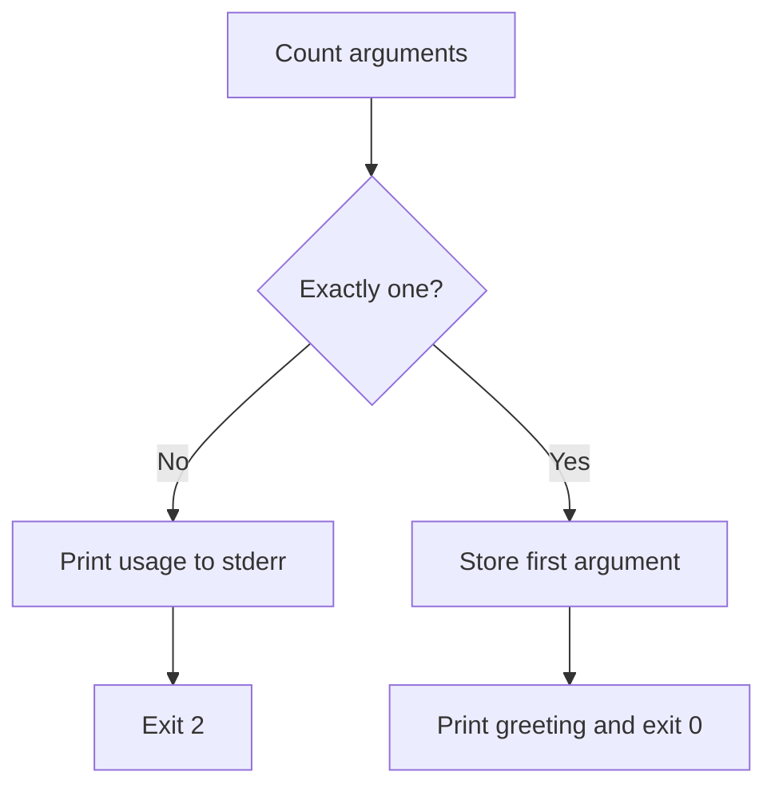
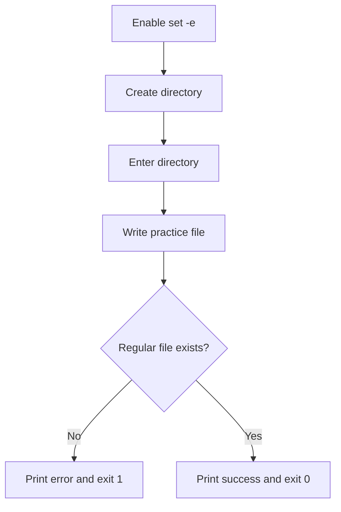
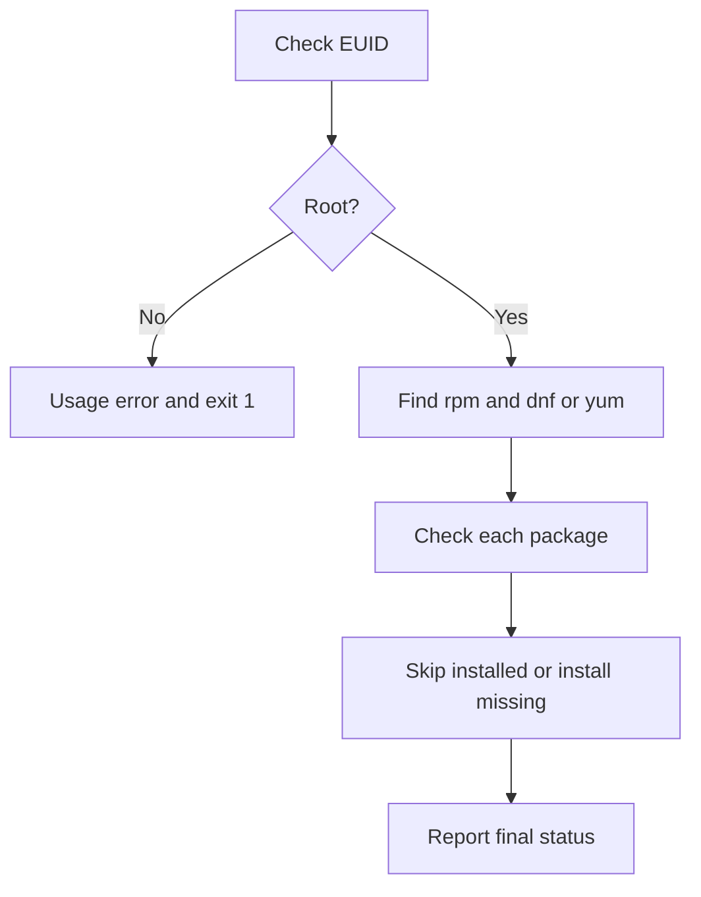
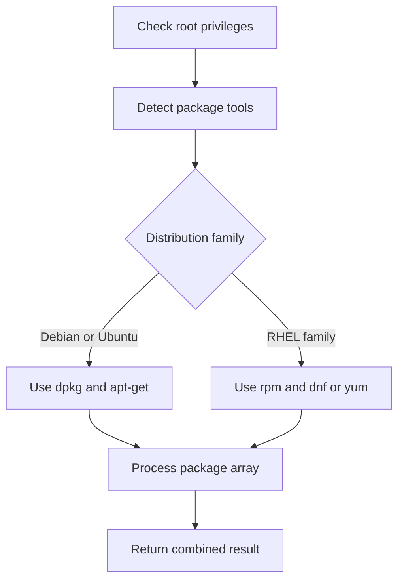
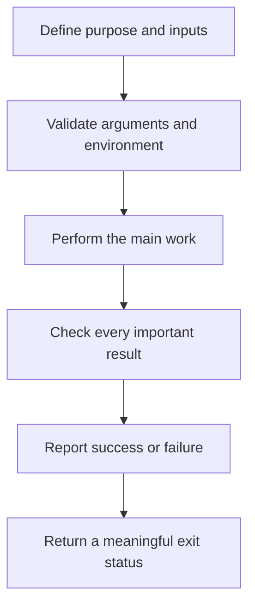

# Task 02 — Bash Scripting Complete Solutions

## Loops, Arguments, Input Validation, Error Handling, and Package Installation

This guide provides complete, beginner-friendly solutions for all eight scripts in Task 02. It explains how each script works, how information moves through it, how failures are handled, and which exit statuses are returned.

## Table of Contents

1. [Solution files](#1-solution-files)
2. [Preparation](#2-preparation)
3. [Task 1A — Fruit list](#3-task-1a--fruit-list)
4. [Task 1B — Count from 1 to 10](#4-task-1b--count-from-1-to-10)
5. [Task 2 — Validated countdown](#5-task-2--validated-countdown)
6. [Task 3A — Greeting argument](#6-task-3a--greeting-argument)
7. [Task 3B — Argument demonstration](#7-task-3b--argument-demonstration)
8. [Task 4 — Safe file-creation workflow](#8-task-4--safe-file-creation-workflow)
9. [Task 5A — RHEL-only package installer](#9-task-5a--rhel-only-package-installer)
10. [Task 5B — Cross-distribution package installer](#10-task-5b--cross-distribution-package-installer)
11. [Testing all solutions](#11-testing-all-solutions)
12. [Exit-code reference](#12-exit-code-reference)
13. [Key learning points](#13-key-learning-points)

---

## 1. Solution Files

The completed directory contains:

```text
task-02/
├── for_loop.sh
├── count.sh
├── countdown.sh
├── greet.sh
├── args_demo.sh
├── safe_script.sh
├── install_packages_rhel.sh
└── install_packages.sh
```

### Overall learning flow



---

## 2. Preparation

Create the working directory and script files:

```bash
mkdir -p task-02
cd task-02

touch for_loop.sh count.sh countdown.sh greet.sh args_demo.sh
touch safe_script.sh install_packages_rhel.sh install_packages.sh
```

After adding the code, make every script executable:

```bash
chmod +x ./*.sh
```

Check permissions:

```bash
ls -l ./*.sh
```

An executable script normally shows `x` in its permissions:

```text
-rwxr-xr-x 1 user user ... for_loop.sh
```

---

## 3. Task 1A — Fruit List

### File: `for_loop.sh`

```bash
#!/bin/bash

# Title: Numbered Fruit List
# Purpose: Print five fruits with item numbers.

fruits=("apple" "banana" "mango" "orange" "red cherry")
item_number=1

for fruit in "${fruits[@]}"
do
    echo "Item $item_number: $fruit"
    item_number=$((item_number + 1))
done

exit 0
```

### Script flow



The loop ends automatically after Bash processes the final array element.

### Block-by-block explanation

#### 1. Create the array

```bash
fruits=("apple" "banana" "mango" "orange" "red cherry")
```

This creates a Bash array containing five elements. Quoting `"red cherry"` keeps the two words together as one array element.

#### 2. Start the counter

```bash
item_number=1
```

The first fruit must be displayed as item `1`, so the counter begins at `1`.

#### 3. Loop safely through the array

```bash
for fruit in "${fruits[@]}"
```

`"${fruits[@]}"` expands every element separately while preserving spaces inside an element. Therefore, `red cherry` remains one fruit.

#### 4. Print and increase

```bash
echo "Item $item_number: $fruit"
item_number=$((item_number + 1))
```

The first line prints the current number and fruit. The arithmetic expansion increases the counter before the next loop cycle.

### Run the script

```bash
./for_loop.sh
```

Output:

```text
Item 1: apple
Item 2: banana
Item 3: mango
Item 4: orange
Item 5: red cherry
```

### Important lesson

Compare these two expansions:

| Expansion | Result |
|---|---|
| `"${fruits[@]}"` | Preserves every array element separately |
| `${fruits[@]}` | May split `red cherry` into two words |

The script returns `exit 0` because reaching the end of the list is successful.

---

## 4. Task 1B — Count from 1 to 10

### File: `count.sh`

```bash
#!/bin/bash

# Title: Count from 1 to 10
# Purpose: Demonstrate a for loop with a numeric brace range.

for number in {1..10}
do
    echo "$number"
done

echo "Counting complete."
exit 0
```

### Explanation

```bash
{1..10}
```

Bash expands the brace range before running the loop:

```text
1 2 3 4 5 6 7 8 9 10
```

During every cycle, the next value is assigned to `number` and printed.

### Run the script

```bash
./count.sh
```

Output:

```text
1
2
3
4
5
6
7
8
9
10
Counting complete.
```

### Flow summary

| Step | Action |
|---:|---|
| 1 | Bash expands `{1..10}` |
| 2 | The next value is assigned to `number` |
| 3 | `echo` prints the value |
| 4 | The loop repeats until `10` is processed |
| 5 | The completion message is printed |
| 6 | The script exits with status `0` |

---

## 5. Task 2 — Validated Countdown

### File: `countdown.sh`

```bash
#!/bin/bash

# Title: Validated Countdown
# Purpose: Count from a user-supplied non-negative whole number to zero.

if ! read -r -p "Enter a starting number: " starting_number; then
    echo "Error: could not read the input." >&2
    exit 1
fi

if [[ ! "$starting_number" =~ ^[0-9]+$ ]]; then
    echo "Error: enter a non-negative whole number." >&2
    exit 1
fi

# The 10# prefix treats values such as 08 as decimal numbers.
count=$((10#$starting_number))

while (( count >= 0 ))
do
    echo "$count"
    count=$((count - 1))
done

echo "Done!"
exit 0
```

### Script flow



### Step-by-step explanation

#### 1. Read input and detect an input failure

```bash
if ! read -r -p "Enter a starting number: " starting_number; then
```

| Part | Meaning |
|---|---|
| `read` | Reads one line from standard input |
| `-r` | Prevents backslashes from being treated as escape characters |
| `-p` | Displays the prompt before reading |
| `starting_number` | Stores the user’s input |
| `!` | Reverses the command result |

If the user sends end-of-file, such as `Ctrl+D`, `read` fails. The `!` makes the condition true, so the error block runs.

#### 2. Validate the input format

```bash
if [[ ! "$starting_number" =~ ^[0-9]+$ ]]; then
```

The regular expression means:

| Symbol | Meaning |
|---|---|
| `^` | Start of the value |
| `[0-9]` | One digit |
| `+` | One or more digits |
| `$` | End of the value |
| `!` | Run the block when the regex does not match |

The validation accepts `0`, `3`, `08`, and `100`. It rejects empty input, `-3`, `2.5`, and `apple`.

#### 3. Convert safely to decimal

```bash
count=$((10#$starting_number))
```

The `10#` prefix tells Bash to interpret the input as base 10. Without it, a leading zero can cause arithmetic values such as `08` to be treated as invalid octal numbers.

#### 4. Run the countdown

```bash
while (( count >= 0 ))
```

The loop continues while `count` is greater than or equal to zero.

```bash
count=$((count - 1))
```

This decreases the value by one during each cycle.

### Successful example

```bash
./countdown.sh
```

```text
Enter a starting number: 3
3
2
1
0
Done!
```

Exit status:

```bash
echo "$?"
```

```text
0
```

### Invalid-input example

```text
Enter a starting number: apple
Error: enter a non-negative whole number.
```

Exit status:

```text
1
```

---

## 6. Task 3A — Greeting Argument

### File: `greet.sh`

```bash
#!/bin/bash

# Title: Command-Line Greeting
# Purpose: Greet exactly one supplied name.

if (( $# != 1 )); then
    echo "Usage: $0 NAME" >&2
    exit 2
fi

name="$1"

echo "Hello, $name!"
exit 0
```

### Script flow



### Explanation

```bash
(( $# != 1 ))
```

- `$#` contains the total number of command-line arguments.
- `!= 1` means “not equal to one.”
- The usage block runs when zero or multiple arguments are supplied.

```bash
echo "Usage: $0 NAME" >&2
```

- `$0` is the name or path used to start the script.
- `>&2` sends the usage message to standard error.

```bash
exit 2
```

Status `2` represents incorrect command usage in this project.

### Correct examples

```bash
./greet.sh Khalid
```

```text
Hello, Khalid!
```

For a multi-word name, quote it so that it remains one argument:

```bash
./greet.sh "Ali Khan"
```

```text
Hello, Ali Khan!
```

### Incorrect examples

```bash
./greet.sh
```

```text
Usage: ./greet.sh NAME
```

```bash
./greet.sh Ali Khan
```

The second command supplies two arguments, so it also returns status `2`. Use quotes for a multi-word name.

---

## 7. Task 3B — Argument Demonstration

### File: `args_demo.sh`

```bash
#!/bin/bash

# Title: Argument Demonstration
# Purpose: Display the script name, argument count, and every argument.

echo "Script name: $0"
echo "Argument count: $#"

printf 'All arguments:'
printf ' %s' "$@"
printf '\n'

argument_number=1

for argument in "$@"
do
    echo "Argument $argument_number: $argument"
    argument_number=$((argument_number + 1))
done

exit 0
```

### Important special parameters

| Parameter | Meaning |
|---|---|
| `$0` | Script name or path |
| `$1` | First argument |
| `$2` | Second argument |
| `$#` | Total number of arguments |
| `"$@"` | All arguments, preserved separately |

### Why `printf` is used for all arguments

```bash
printf ' %s' "$@"
```

`printf` applies the format once to every argument. Because `"$@"` is quoted, `red cherry` remains one argument.

### Run the script

```bash
./args_demo.sh apple banana "red cherry"
```

Output:

```text
Script name: ./args_demo.sh
Argument count: 3
All arguments: apple banana red cherry
Argument 1: apple
Argument 2: banana
Argument 3: red cherry
```

### Argument flow

| Command-line value | Positional parameter |
|---|---|
| `apple` | `$1` |
| `banana` | `$2` |
| `red cherry` | `$3` |
| Total | `$#` is `3` |

The script accepts zero or more arguments, so an empty argument list is not treated as an error.

---

## 8. Task 4 — Safe File-Creation Workflow

### File: `safe_script.sh`

```bash
#!/bin/bash

# Title: Safe File-Creation Workflow
# Purpose: Create a directory and practice file with explicit error handling.

set -e

work_directory="/tmp/devops-test"
practice_file="$work_directory/practice.txt"

mkdir -p -- "$work_directory" || {
    echo "Error: could not create $work_directory." >&2
    exit 1
}

echo "Directory ready: $work_directory"

cd -- "$work_directory" || {
    echo "Error: could not enter $work_directory." >&2
    exit 1
}

printf '%s\n' "DevOps practice" > "$practice_file" || {
    echo "Error: could not write to $practice_file." >&2
    exit 1
}

if [[ ! -f "$practice_file" ]]; then
    echo "Error: regular file was not created: $practice_file" >&2
    exit 1
fi

echo "File created: $practice_file"
echo "Task completed successfully."
exit 0
```

### Script flow



### Important commands

#### `set -e`

```bash
set -e
```

This asks Bash to terminate when an unhandled simple command fails. It is a safety aid, not a complete error-handling system.

#### `mkdir -p --`

```bash
mkdir -p -- "$work_directory"
```

| Part | Purpose |
|---|---|
| `mkdir` | Creates a directory |
| `-p` | Accepts an existing directory and creates missing parents |
| `--` | Marks the end of command options |
| `"$work_directory"` | Passes the directory as one safely quoted argument |

#### Error block with `||`

```bash
command || {
    echo "Error" >&2
    exit 1
}
```

The right side of `||` runs only if the command on the left fails. The braces group multiple error-handling commands.

Because a command before `||` is being tested, `set -e` does not immediately exit there. The explicit `exit 1` inside the error block intentionally stops the script.

#### Write the file

```bash
printf '%s\n' "DevOps practice" > "$practice_file"
```

`>` opens the target file for writing. It creates the file when missing and replaces its old contents when it already exists.

#### Verify a regular file

```bash
[[ -f "$practice_file" ]]
```

`-f` succeeds when the supplied path exists and is a regular file.

### Run the script

```bash
./safe_script.sh
```

Expected output:

```text
Directory ready: /tmp/devops-test
File created: /tmp/devops-test/practice.txt
Task completed successfully.
```

Verify the result:

```bash
cat /tmp/devops-test/practice.txt
```

```text
DevOps practice
```

### Practical failure examples

The script exits with status `1` if it cannot:

- Create the directory
- Enter the directory
- Open or write the file
- Confirm the regular file

The success messages appear only after the required operations succeed.

---

## 9. Task 5A — RHEL-Only Package Installer

### File: `install_packages_rhel.sh`

```bash
#!/bin/bash

# Title: RHEL-Family Package Installer
# Purpose: Install nginx, curl, and wget when missing.
# Usage: sudo ./install_packages_rhel.sh

if (( EUID != 0 )); then
    echo "Error: run this script with sudo." >&2
    echo "Usage: sudo $0" >&2
    exit 1
fi

if ! command -v rpm >/dev/null 2>&1; then
    echo "Error: rpm is not available; this is not a supported RHEL-family system." >&2
    exit 1
fi

if command -v dnf >/dev/null 2>&1; then
    package_manager="dnf"
    install_command=(dnf install -y --)
elif command -v yum >/dev/null 2>&1; then
    package_manager="yum"
    install_command=(yum install -y --)
else
    echo "Error: neither dnf nor yum is available." >&2
    exit 1
fi

packages=("nginx" "curl" "wget")
installation_failed=0

echo "Selected package manager: $package_manager"

for package in "${packages[@]}"
do
    if rpm -q "$package" >/dev/null 2>&1; then
        echo "[INSTALLED] $package is already installed."
        continue
    fi

    echo "[MISSING] Installing $package..."

    if "${install_command[@]}" "$package"; then
        echo "[SUCCESS] $package was installed."
    else
        echo "[ERROR] $package installation failed." >&2
        installation_failed=1
    fi
done

if (( installation_failed != 0 )); then
    echo "Error: one or more packages could not be installed." >&2
    exit 1
fi

echo "All packages are installed or were already present."
exit 0
```

### Installer flow



### Step-by-step explanation

#### 1. Check administrative privileges

```bash
if (( EUID != 0 )); then
```

`EUID` is Bash’s effective user ID. Root’s effective user ID is `0`. Package installation requires administrative privileges.

Run the script with:

```bash
sudo ./install_packages_rhel.sh
```

Do not stay inside a root shell unnecessarily.

#### 2. Check command availability

```bash
command -v rpm >/dev/null 2>&1
```

| Component | Meaning |
|---|---|
| `command -v rpm` | Checks whether Bash can locate `rpm` |
| `>/dev/null` | Discards normal output |
| `2>&1` | Sends error output to the same destination as normal output |

Only the exit status matters:

- `0`: command found
- Nonzero: command not found

#### 3. Select `dnf` or `yum`

```bash
install_command=(dnf install -y --)
```

The installation command is stored as an array. This preserves every command component as a separate argument.

```bash
"${install_command[@]}" "$package"
```

This expands the command array safely and appends the current package name.

#### 4. Check package installation

```bash
rpm -q "$package" >/dev/null 2>&1
```

- Status `0`: the package is installed.
- Nonzero status: the package is not installed or the query failed.

For the fixed package names used in this lab, the nonzero result is treated as “missing.”

#### 5. Skip installed packages

```bash
continue
```

`continue` stops the current loop cycle and moves directly to the next package.

#### 6. Record individual failures

```bash
installation_failed=1
```

The script does not stop after one failed installation. It records the failure and checks the remaining packages. At the end, the flag determines the final exit status.

### Example root-check failure

```bash
./install_packages_rhel.sh
```

```text
Error: run this script with sudo.
Usage: sudo ./install_packages_rhel.sh
```

Exit status: `1`.

### Representative successful output

Actual package-manager output varies. The script’s status lines may look like:

```text
Selected package manager: dnf
[INSTALLED] curl is already installed.
[MISSING] Installing nginx...
[SUCCESS] nginx was installed.
[MISSING] Installing wget...
[SUCCESS] wget was installed.
All packages are installed or were already present.
```

### Why `dnf update` is not included

This task installs named packages; it should not perform a full system upgrade. `dnf install` refreshes metadata when required according to the system’s cache policy. A full update is a separate administrative operation requiring its own change planning.

---

## 10. Task 5B — Cross-Distribution Package Installer

### File: `install_packages.sh`

```bash
#!/bin/bash

# Title: Cross-Distribution Package Installer
# Purpose: Install nginx, curl, and wget on Debian/Ubuntu or RHEL-family systems.
# Usage: sudo ./install_packages.sh

if (( EUID != 0 )); then
    echo "Error: run this script with sudo." >&2
    echo "Usage: sudo $0" >&2
    exit 1
fi

packages=("nginx" "curl" "wget")
installation_failed=0

if command -v dpkg >/dev/null 2>&1 &&
   command -v apt-get >/dev/null 2>&1; then

    distribution_family="Debian/Ubuntu"
    package_manager="apt-get"

    is_installed()
    {
        dpkg -s "$1" >/dev/null 2>&1
    }

    install_package()
    {
        DEBIAN_FRONTEND=noninteractive apt-get install -y -- "$1"
    }

elif command -v rpm >/dev/null 2>&1; then

    distribution_family="RHEL"

    if command -v dnf >/dev/null 2>&1; then
        package_manager="dnf"
        install_command=(dnf install -y --)
    elif command -v yum >/dev/null 2>&1; then
        package_manager="yum"
        install_command=(yum install -y --)
    else
        echo "Error: neither dnf nor yum is available." >&2
        exit 1
    fi

    is_installed()
    {
        rpm -q "$1" >/dev/null 2>&1
    }

    install_package()
    {
        "${install_command[@]}" "$1"
    }

else
    echo "Error: supported package-management tools were not found." >&2
    exit 1
fi

echo "Detected system family: $distribution_family"
echo "Selected package manager: $package_manager"

for package in "${packages[@]}"
do
    if is_installed "$package"; then
        echo "[INSTALLED] $package is already installed."
        continue
    fi

    echo "[MISSING] Installing $package..."

    if install_package "$package"; then
        echo "[SUCCESS] $package was installed."
    else
        echo "[ERROR] $package installation failed." >&2
        installation_failed=1
    fi
done

if (( installation_failed != 0 )); then
    echo "Error: one or more packages could not be installed." >&2
    exit 1
fi

echo "All packages are installed or were already present."
exit 0
```

### Cross-distribution flow



### Why functions are useful here

Both system families need the same high-level workflow:

1. Check whether a package is installed.
2. Install it when missing.
3. Print the result.

However, the underlying commands are different. The script gives both implementations the same function names:

```bash
is_installed "$package"
install_package "$package"
```

The main loop does not need separate Debian and RHEL branches for every package.

### Debian/Ubuntu branch

```bash
dpkg -s "$1" >/dev/null 2>&1
```

`dpkg -s` queries the local package database.

```bash
DEBIAN_FRONTEND=noninteractive apt-get install -y -- "$1"
```

| Part | Purpose |
|---|---|
| `DEBIAN_FRONTEND=noninteractive` | Prevents interactive configuration questions when possible |
| `apt-get install` | Installs the package |
| `-y` | Automatically answers yes to the package-manager confirmation |
| `--` | Ends command-option processing |
| `"$1"` | Passes the function’s first argument as the package name |

> In a freshly created Debian/Ubuntu lab, run `sudo apt-get update` before the installer if the local package index is missing or stale. `apt-get update` refreshes metadata; it does not upgrade installed packages.

### RHEL branch

The RHEL branch reuses the design from `install_packages_rhel.sh`:

- `rpm -q` checks package state.
- `dnf` is preferred.
- `yum` is used as a fallback.
- The selected installation command is stored in an array.

### Function positional parameters

Inside a function, `$1` refers to the first argument passed to that function—not necessarily the first argument passed to the entire script.

Example:

```bash
is_installed "$package"
```

If `package="curl"`, then `$1` inside `is_installed` is `curl`.

### Why the main loop continues after failure

Stopping after the first failed package would leave the remaining packages unchecked. Instead, the script:

1. Records the failure.
2. Continues through the list.
3. Returns a combined failure status at the end.

This is useful for batch automation because the output reports every attempted item.

### Example on Ubuntu

```bash
sudo apt-get update
sudo ./install_packages.sh
```

Representative output:

```text
Detected system family: Debian/Ubuntu
Selected package manager: apt-get
[INSTALLED] curl is already installed.
[MISSING] Installing nginx...
[SUCCESS] nginx was installed.
[INSTALLED] wget is already installed.
All packages are installed or were already present.
```

### Example on Rocky Linux or AlmaLinux

```bash
sudo ./install_packages.sh
```

Representative output:

```text
Detected system family: RHEL
Selected package manager: dnf
[INSTALLED] curl is already installed.
[MISSING] Installing nginx...
[SUCCESS] nginx was installed.
[INSTALLED] wget is already installed.
All packages are installed or were already present.
```

### Package-installer exit paths

| Situation | Exit status |
|---|---:|
| Not run with root privileges | `1` |
| Required package tools unavailable | `1` |
| At least one package installation fails | `1` |
| All packages installed or already present | `0` |

### Safety notes

- Run package installers only in an approved lab system.
- Use `sudo ./script.sh` instead of opening a long-lived root shell.
- Review the package list before execution.
- Do not add a full `dnf update`, `yum update`, or `apt-get upgrade` to a simple installer without planning the broader system change.
- Package names and repositories may vary across distributions.

---

## 11. Testing All Solutions

### Step 1: Check Bash syntax

```bash
for script in ./*.sh
do
    if bash -n "$script"; then
        echo "[SYNTAX OK] $script"
    else
        echo "[SYNTAX ERROR] $script" >&2
        exit 1
    fi
done
```

Example output:

```text
[SYNTAX OK] ./args_demo.sh
[SYNTAX OK] ./count.sh
[SYNTAX OK] ./countdown.sh
[SYNTAX OK] ./for_loop.sh
[SYNTAX OK] ./greet.sh
[SYNTAX OK] ./install_packages.sh
[SYNTAX OK] ./install_packages_rhel.sh
[SYNTAX OK] ./safe_script.sh
```

`bash -n` checks syntax without executing the script.

### Step 2: Run ordinary scripts

```bash
./for_loop.sh
./count.sh
./countdown.sh
./greet.sh Khalid
./args_demo.sh apple banana "red cherry"
./safe_script.sh
```

### Step 3: Test expected failures

| Test | Expected result |
|---|---|
| Enter `apple` in `countdown.sh` | Validation error; status `1` |
| Press `Ctrl+D` at countdown prompt | Read error; status `1` |
| Run `greet.sh` without a name | Usage error; status `2` |
| Run `greet.sh Ali Khan` without quotes | Usage error; status `2` |
| Run either installer without `sudo` | Privilege error; status `1` |

Check the status immediately:

```bash
echo "$?"
```

### Step 4: Trace a script

```bash
bash -x ./countdown.sh
```

`bash -x` displays expanded commands as Bash executes them. It is useful for learning and troubleshooting but may expose data contained in variables, so use it carefully with sensitive scripts.

### Step 5: Run package installers only in a lab

RHEL-family system:

```bash
sudo ./install_packages_rhel.sh
```

Supported Debian/Ubuntu or RHEL-family system:

```bash
sudo ./install_packages.sh
```

---

## 12. Exit-Code Reference

### Exit codes used in these solutions

| Code | Meaning in this project | Example |
|---:|---|---|
| `0` | Successful completion | Loop completed or packages are ready |
| `1` | General runtime, validation, privilege, or installation failure | Invalid countdown input or failed package installation |
| `2` | Incorrect command-line usage | Wrong number of arguments for `greet.sh` |

### Command status versus script exit

Every command returns a status. The script can inspect that status using `if`, `!`, `&&`, or `||` and then decide whether to continue or call `exit`.

```bash
if command; then
    echo "Command succeeded"
else
    status=$?
    echo "Command failed with status $status" >&2
fi
```

### Important rule about `$?`

Capture `$?` immediately after the command whose status you need:

```bash
command
status=$?
```

Running another command first overwrites `$?`.

---

## 13. Key Learning Points

### Three main lessons

1. **Quote data and preserve list elements.** Use `"$variable"`, `"$@"`, and `"${array[@]}"` so spaces do not accidentally split one value into multiple words.
2. **Validate before processing.** Check input format, argument count, required commands, and privileges before entering the main work section.
3. **Treat failures as part of the design.** Send errors to `stderr`, use meaningful exit statuses, and print success only after required commands succeed.

### Complete script-design flow



### Final checklist

- [ ] Every script begins with `#!/bin/bash`.
- [ ] Variables containing data are quoted.
- [ ] Arrays use `"${array[@]}"`.
- [ ] Argument loops use `"$@"`.
- [ ] User input is validated before arithmetic.
- [ ] Error messages use `>&2`.
- [ ] Incorrect command usage returns status `2`.
- [ ] Runtime failures return a nonzero status.
- [ ] Success messages are printed only after success.
- [ ] Package installers verify `EUID` and required tools.
- [ ] All scripts pass `bash -n`.
- [ ] Package installation is tested only in an approved lab.
