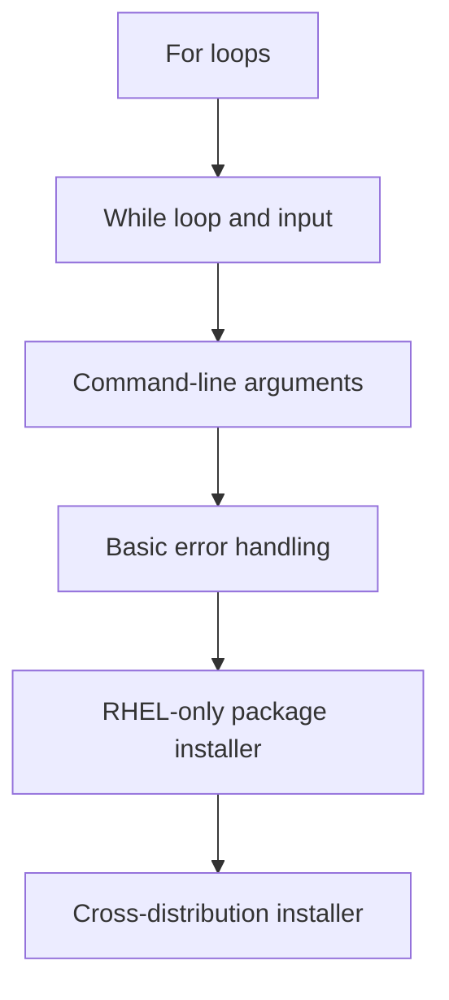

# Task 02 — Bash Scripting: Loops, Arguments, and Error Handling

## Objective

Level up your Bash scripting skills by writing loops, processing command-line arguments, validating input, handling failures, and building a basic cross-distribution package installer.

By completing this challenge, you will practise:

- `for` and `while` loops
- Arrays and `"${array[@]}"`
- Command-line arguments: `$0`, `$1`, `$#`, and `"$@"`
- Input validation
- Exit statuses and `exit`
- Error messages using `stderr`
- Basic error handling with `if`, `||`, and `set -e`
- Package checks using `dpkg -s` or `rpm -q`
- Root-privilege validation using `EUID`

---

## Learning Flow



Complete the tasks in this order. Each task introduces skills needed by the next one.

---

## Expected Deliverables

Create the following files:

```text
task-02/
├── for_loop.sh
├── count.sh
├── countdown.sh
├── greet.sh
├── args_demo.sh
├── safe_script.sh
├── install_packages_rhel.sh
├── install_packages.sh
└── task-02-scripting.md
```

Your submission must include:

- All eight Bash scripts
- One documentation file named `task-02-scripting.md`
- Sample commands and output for every script
- Three key points describing what you learned

---

## Preparation

Create and enter a working directory:

```bash
mkdir -p task-02
cd task-02
```

Create the required files:

```bash
touch for_loop.sh count.sh countdown.sh greet.sh args_demo.sh
touch safe_script.sh install_packages_rhel.sh install_packages.sh
touch task-02-scripting.md
```

Every Bash script should start with:

```bash
#!/bin/bash
```

After writing the scripts, make them executable:

```bash
chmod +x ./*.sh
```

---

# Challenge Tasks

## Task 1 — `for` Loops

### Part A: Fruit List

Create `for_loop.sh` that:

1. Defines an array containing these five fruits:
   - `apple`
   - `banana`
   - `mango`
   - `orange`
   - `red cherry`
2. Loops through the array using a `for` loop.
3. Prints each fruit with an item number.

Expected output:

```text
Item 1: apple
Item 2: banana
Item 3: mango
Item 4: orange
Item 5: red cherry
```

Requirements:

- Use a Bash array.
- Expand the array safely with `"${fruits[@]}"` so that `red cherry` remains one item.
- Use a variable to track the item number.

### Part B: Count from 1 to 10

Create `count.sh` that:

1. Uses a `for` loop.
2. Prints the numbers `1` through `10`.
3. Prints `Counting complete.` after the loop finishes.

Expected output:

```text
1
2
3
4
5
6
7
8
9
10
Counting complete.
```

---

## Task 2 — `while` Loop and Input Validation

Create `countdown.sh` that:

1. Prompts the user to enter a starting number.
2. Checks whether the `read` command succeeds.
3. Validates that the input is a non-negative whole number such as `0`, `5`, or `10`.
4. Rejects empty input, negative numbers, decimal numbers, and text.
5. Uses a `while` loop to count down from the supplied number to `0`.
6. Prints `Done!` when the loop finishes.
7. Sends error messages to `stderr` and exits with status `1` when the input is invalid.

Example successful run:

```text
Enter a starting number: 3
3
2
1
0
Done!
```

Example invalid run:

```text
Enter a starting number: apple
Error: enter a non-negative whole number.
```

Suggested validation pattern:

```bash
^[0-9]+$
```

> The regex validates the input format. The `while` loop performs the countdown.

---

## Task 3 — Command-Line Arguments

### Part A: Greeting Script

Create `greet.sh` that:

1. Accepts exactly one name as `$1`.
2. Prints `Hello, <name>!` when one argument is supplied.
3. Prints a usage message to `stderr` when the argument count is incorrect.
4. Exits with status `2` for incorrect command-line usage.

Correct execution:

```bash
./greet.sh Khalid
```

Expected output:

```text
Hello, Khalid!
```

Incorrect execution:

```bash
./greet.sh
```

Expected error:

```text
Usage: ./greet.sh NAME
```

> Use `"$1"` when reading the name. A multi-word name can be passed as one argument with quotes: `./greet.sh "Ali Khan"`.

### Part B: Argument Demonstration

Create `args_demo.sh` that prints:

1. The script name using `$0`.
2. The total number of arguments using `$#`.
3. All arguments using `"$@"`.
4. Every argument on a separate numbered line by looping over `"$@"`.

Example command:

```bash
./args_demo.sh apple banana "red cherry"
```

Expected output format:

```text
Script name: ./args_demo.sh
Argument count: 3
All arguments: apple banana red cherry
Argument 1: apple
Argument 2: banana
Argument 3: red cherry
```

> Always prefer `"$@"` when forwarding or looping through arguments. It preserves every original argument separately.

---

## Task 4 — Basic Error Handling

Create `safe_script.sh` that:

1. Enables exit-on-unhandled-error behavior with `set -e`.
2. Stores `/tmp/devops-test` in a variable.
3. Creates the directory using `mkdir -p`.
4. Navigates into the directory.
5. Creates a file named `practice.txt`.
6. Writes `DevOps practice` into the file.
7. Confirms that the file is a regular file using `[[ -f ... ]]`.
8. Prints a success message only after every required step succeeds.
9. Uses `||` with an error message and `exit 1` for the important commands.
10. Sends all error messages to `stderr`.

Use this error-handling structure:

```bash
command || {
    echo "Error: command failed." >&2
    exit 1
}
```

Example for directory creation:

```bash
mkdir -p -- "$work_directory" || {
    echo "Error: could not create $work_directory." >&2
    exit 1
}
```

Expected successful output:

```text
Directory ready: /tmp/devops-test
File created: /tmp/devops-test/practice.txt
Task completed successfully.
```

### Important note about `set -e` and `||`

`set -e` does not immediately terminate the script when a failing command is being tested by `||`. Therefore, the error block must explicitly use `exit 1` when the script should stop.

Avoid this pattern:

```bash
mkdir /tmp/devops-test || echo "Directory already exists"
```

That message can be inaccurate because `mkdir` may fail for reasons other than an existing directory, such as permission problems. Use `mkdir -p` when an existing directory should be accepted.

---

## Task 5 — Package Installation Project

Complete this task in two stages. Part A introduces package management on one known distribution family. Part B extends the same logic so the script can work on more than one distribution family.

### Part A — RHEL-Only Package Installer

Create `install_packages_rhel.sh` for RHEL-family systems such as RHEL, Rocky Linux, AlmaLinux, or CentOS Stream.

The script must:

1. Confirm that it is running with effective user ID `0`.
2. If it is not running as root:
   - Print `Error: run this script with sudo.` to `stderr`.
   - Print `Usage: sudo ./install_packages_rhel.sh` to `stderr`.
   - Exit with status `1`.
3. Confirm that the `rpm` command is available.
4. Select `dnf` as the installer when available.
5. Fall back to `yum` when `dnf` is unavailable.
6. Exit with an error if neither `dnf` nor `yum` is available.
7. Define a package array containing:
   - `nginx`
   - `curl`
   - `wget`
8. Loop through the array using `"${packages[@]}"`.
9. Check each package with `rpm -q "$package"`.
10. Skip a package when it is already installed.
11. Install a missing package with the selected package manager.
12. Print a clear status for every package:
    - `[INSTALLED]`
    - `[MISSING]`
    - `[SUCCESS]`
    - `[ERROR]`
13. Continue checking the remaining packages when one installation fails.
14. Record whether any installation failed.
15. Exit with status `1` when one or more installations failed; otherwise exit with status `0`.

RHEL package check:

```bash
rpm -q "$package" >/dev/null 2>&1
```

Example package-manager selection:

```bash
if command -v dnf >/dev/null 2>&1; then
    install_command=(dnf install -y)
elif command -v yum >/dev/null 2>&1; then
    install_command=(yum install -y)
else
    echo "Error: neither dnf nor yum is available." >&2
    exit 1
fi
```

Use the command array safely:

```bash
"${install_command[@]}" "$package"
```

Recommended execution on a RHEL-family lab system:

```bash
sudo ./install_packages_rhel.sh
```

### Part B — Cross-Distribution Package Installer

After the RHEL-only script works correctly, create `install_packages.sh` by extending the same design.

This script must support:

- Debian/Ubuntu systems using `dpkg` and `apt-get`
- RHEL-family systems using `rpm` with `dnf` or `yum`

The script must:

1. Perform the same `EUID` root check used in Part A.
2. Define the same `nginx`, `curl`, and `wget` package array.
3. Detect the available package-management family:
   - If both `dpkg` and `apt-get` are available, select Debian/Ubuntu logic.
   - Otherwise, if `rpm` is available, select RHEL-family logic.
   - Otherwise, report that no supported package-management tools were found.
4. Define or select the correct package-check logic:
   - Debian/Ubuntu: `dpkg -s "$package"`
   - RHEL-family: `rpm -q "$package"`
5. Define or select the correct installation command:
   - Debian/Ubuntu: `apt-get install -y -- "$package"`
   - RHEL-family: `dnf install -y -- "$package"` or `yum install -y -- "$package"`
6. Print the detected distribution family.
7. Loop through the package array using `"${packages[@]}"`.
8. Skip packages that are already installed.
9. Install missing packages.
10. Continue processing after an individual installation failure.
11. Return a final failure status if any package could not be installed.

Root check for both scripts:

```bash
if (( EUID != 0 )); then
    echo "Error: run this script with sudo." >&2
    echo "Usage: sudo $0" >&2
    exit 1
fi
```

Debian/Ubuntu package check:

```bash
dpkg -s "$package" >/dev/null 2>&1
```

RHEL-family package check:

```bash
rpm -q "$package" >/dev/null 2>&1
```

Recommended execution:

```bash
sudo ./install_packages.sh
```

### Why the project is divided into two parts

| Stage | Main learning goal |
|---|---|
| Part A — RHEL only | Understand one package database and one installation flow |
| Part B — Cross-distribution | Add command detection, branching, and reusable logic |

Part A reduces the number of new concepts. Part B then teaches students how a working single-platform script can be generalized without changing its core loop and error-handling design.

> Do not use `sudo -i` or `sudo su` for this task. Running only the required script with `sudo` is clearer and avoids staying inside an unnecessary root shell.

> Package installation changes the system. Run these scripts only in an approved learning VM, WSL distribution, cloud lab, or other disposable practice environment.

---

## Testing and Verification

### 1. Check the syntax of every script

```bash
for script in ./*.sh
do
    bash -n "$script" || exit 1
done
```

No output means all scripts passed the Bash syntax check.

### 2. Run the non-privileged scripts

```bash
./for_loop.sh
./count.sh
./countdown.sh
./greet.sh Khalid
./args_demo.sh apple banana "red cherry"
./safe_script.sh
```

### 3. Test expected error paths

```bash
./countdown.sh
./greet.sh
./greet.sh Ali Khan
./install_packages_rhel.sh
./install_packages.sh
```

Check the most recent exit status immediately after a test:

```bash
echo "$?"
```

### 4. Run the package installers in approved labs

On a RHEL-family lab:

```bash
sudo ./install_packages_rhel.sh
```

After completing Part B, run the cross-distribution version on a supported lab:

```bash
sudo ./install_packages.sh
```

---

## Documentation Requirements

Create `task-02-scripting.md` with the following structure:

```markdown
# Task 02 — Bash Scripting

## Environment

- Operating system:
- Bash version:
- Date completed:

## Task 1 — For Loops

### for_loop.sh
- Code
- Command used
- Output
- Explanation

### count.sh
- Code
- Command used
- Output
- Explanation

## Task 2 — While Loop

### countdown.sh
- Code
- Valid-input output
- Invalid-input output
- Explanation

## Task 3 — Arguments

### greet.sh
- Code
- Correct-usage output
- Incorrect-usage output
- Explanation

### args_demo.sh
- Code
- Command used
- Output
- Explanation

## Task 4 — Error Handling

### safe_script.sh
- Code
- Output
- Exit-status test
- Explanation

## Task 5 — Package Installer

### install_packages_rhel.sh
- Code
- Selected package manager (`dnf` or `yum`)
- Output
- Root-check result
- Explanation

### install_packages.sh
- Code
- Detected distribution family and package manager
- Output
- Root-check result
- Explanation

## What I Learned

1.
2.
3.
```

When inserting script code, use fenced code blocks:

````markdown
```bash
#!/bin/bash
echo "Example"
```
````

When inserting terminal output, use `text` blocks:

````markdown
```text
Example output
```
````

---

## Submission Checklist

- [ ] All eight scripts are included.
- [ ] Every script begins with `#!/bin/bash`.
- [ ] All variable expansions representing data are quoted.
- [ ] Arrays are expanded with `"${array[@]}"`.
- [ ] Error messages are sent to `stderr`.
- [ ] Invalid input produces a nonzero exit status.
- [ ] Both package installers check `EUID` before installation.
- [ ] The RHEL-only installer is completed before the cross-distribution version.
- [ ] Package installers are tested only in approved lab environments.
- [ ] Every script passes `bash -n`.
- [ ] `task-02-scripting.md` contains code, commands, output, and explanations.
- [ ] Three learning points are documented.

---

## Hints

| Topic | Recommended syntax | Purpose |
|---|---|---|
| For loop | `for item in list; do ...; done` | Process every item in a list |
| Array loop | `for item in "${items[@]}"` | Preserve each array element |
| While loop | `while (( number >= 0 )); do ...; done` | Repeat while a numeric condition is true |
| First argument | `${1:-}` | Read `$1` safely when it may be missing |
| Argument count | `$#` | Count command-line arguments |
| All arguments | `"$@"` | Preserve all arguments separately |
| Numeric comparison | `(( value != 2 ))` | Compare integer values |
| Root check | `(( EUID != 0 ))` | Detect whether the script has root privileges |
| Error output | `echo "Error" >&2` | Send a message to `stderr` |
| Success | `exit 0` | Report successful completion |
| Failure | `exit 1` | Report a general failure |
| Usage error | `exit 2` | Report incorrect command-line usage |
| Syntax check | `bash -n script.sh` | Check Bash syntax without executing the script |
| Trace execution | `bash -x script.sh` | Display commands as Bash executes them |

---

## Final Goal

By the end of this challenge, you should be able to design a Bash script using this flow:

1. Add a shebang and purpose comments.
2. Read arguments or user input.
3. Validate the supplied data and required privileges.
4. Process items with a loop.
5. Check command results.
6. Send normal output to `stdout` and errors to `stderr`.
7. Exit with a meaningful status.
8. Document and test both success and failure paths.
