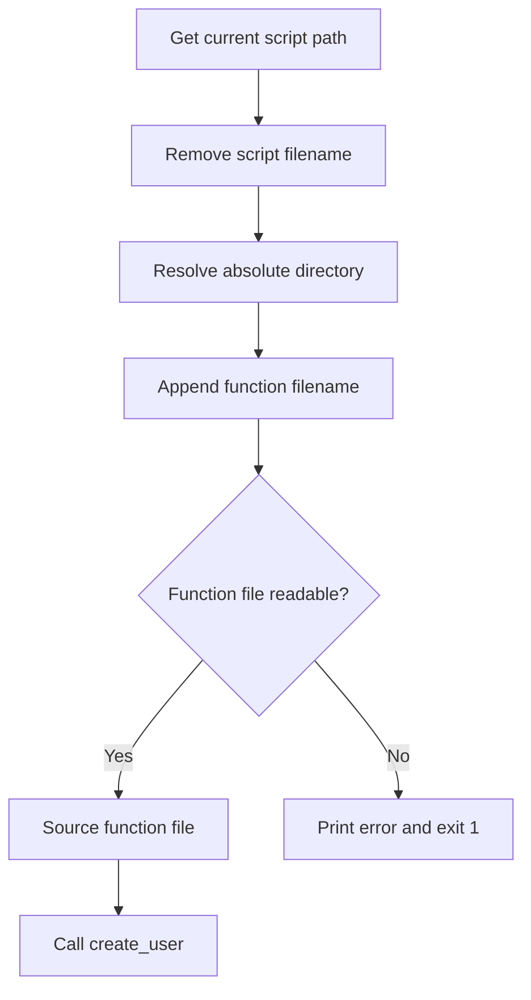

# Bash Script Directory and Function File Path — Study Notes

## Objective

These two lines find the directory containing the current Bash script and build the full path to a separate function file:

```bash
script_directory="$(cd -- "$(dirname -- "${BASH_SOURCE[0]}")" && pwd)"
function_file="$script_directory/create_user_function.sh"
```

This technique allows a master script to locate its supporting file reliably—even when the master script is launched from another directory.

## Quick Summary

| Variable | Stores |
|---|---|
| `script_directory` | Absolute path of the directory containing the current script |
| `function_file` | Absolute path of `create_user_function.sh` |

Example result:

```bash
script_directory="/home/khalid/user-management"
function_file="/home/khalid/user-management/create_user_function.sh"
```

## First Line

```bash
script_directory="$(cd -- "$(dirname -- "${BASH_SOURCE[0]}")" && pwd)"
```

This expression is easiest to understand from the inside outward.

| Part | Purpose |
|---|---|
| `${BASH_SOURCE[0]}` | Gives the path used to load the current Bash file |
| `dirname -- ...` | Removes the script filename and returns its directory |
| `cd -- ...` | Changes into that directory |
| `&&` | Runs `pwd` only when `cd` succeeds |
| `pwd` | Prints the absolute path of the current directory |
| `$(...)` | Captures the command output |
| `script_directory="..."` | Saves the captured path in a variable |

### Step-by-step example

Assume the master script is stored here:

```text
/home/khalid/user-management/service_action_menue.sh
```

### Step 1: Get the current script path

```bash
${BASH_SOURCE[0]}
```

Possible value:

```text
/home/khalid/user-management/service_action_menue.sh
```

`BASH_SOURCE` is a Bash array. Element `[0]` refers to the current script or sourced file.

### Step 2: Remove the filename

```bash
dirname -- "${BASH_SOURCE[0]}"
```

Output:

```text
/home/khalid/user-management
```

`dirname` does not inspect the filesystem. It processes the supplied path and removes its final component.

### Step 3: Enter that directory

```bash
cd -- "$(dirname -- "${BASH_SOURCE[0]}")"
```

The quotes preserve directory names containing spaces.

### Step 4: Print the absolute path

```bash
pwd
```

Output:

```text
/home/khalid/user-management
```

### Step 5: Capture the result

The outer command substitution captures the `pwd` output:

```bash
$(cd -- "$(dirname -- "${BASH_SOURCE[0]}")" && pwd)
```

The assignment stores it:

```bash
script_directory="/home/khalid/user-management"
```

## Why `&&` Is Used

```bash
cd -- "directory" && pwd
```

`&&` means: run the next command only if the previous command succeeds.

Therefore:

- If `cd` succeeds, Bash runs `pwd`.
- If `cd` fails, Bash does not run `pwd`.

This prevents the script from accidentally capturing the wrong working directory.

## Why `--` Is Used

```bash
dirname -- "${BASH_SOURCE[0]}"
cd -- "directory"
```

The `--` marker means:

> Command options end here; treat the remaining value as an argument.

It helps protect against a path beginning with a hyphen, which might otherwise be mistaken for a command option.

## Second Line

```bash
function_file="$script_directory/create_user_function.sh"
```

This line combines:

1. The directory containing the master script.
2. The name of the separate function file.

If:

```bash
script_directory="/home/khalid/user-management"
```

then the result is:

```bash
function_file="/home/khalid/user-management/create_user_function.sh"
```

The variable is quoted because paths may contain spaces or wildcard characters.

## Loading the Function File

After building the full path, load the file with `source`:

```bash
source "$function_file"
```

The `source` command reads and executes the file in the current Bash shell. Functions defined inside that file then become available to the master script.

Example:

```bash
source "$function_file"
create_user
```

The shorter equivalent form is:

```bash
. "$function_file"
```

For beginners, `source` is usually clearer.

## Why a Simple Relative Path Can Fail

This is less reliable:

```bash
source create_user_function.sh
```

It searches relative to the shell's current working directory—not necessarily the directory containing the master script.

For example:

```bash
cd /tmp
bash /home/khalid/user-management/service_action_menue.sh
```

The shell is currently in `/tmp`, so a simple relative path may make Bash search for:

```text
/tmp/create_user_function.sh
```

The robust approach still builds the correct path:

```text
/home/khalid/user-management/create_user_function.sh
```

## Recommended Complete Pattern

```bash
#!/bin/bash

script_directory="$(cd -- "$(dirname -- "${BASH_SOURCE[0]}")" && pwd)"
function_file="$script_directory/create_user_function.sh"

if [[ ! -r "$function_file" ]]; then
    echo "Error: cannot read function file: $function_file" >&2
    exit 1
fi

source "$function_file"

if ! declare -F create_user >/dev/null; then
    echo "Error: create_user function was not loaded." >&2
    exit 1
fi

create_user
```

### What the safety checks do

| Check | Meaning |
|---|---|
| `[[ ! -r "$function_file" ]]` | The file does not exist or is not readable |
| `>&2` | Sends the error message to standard error |
| `exit 1` | Stops the master script with a failure status |
| `declare -F create_user` | Checks whether the function is defined |
| `>/dev/null` | Hides normal output from the function check |

## Execution Flow



## Important Difference: Current Directory vs Script Directory

| Term | Meaning | Useful command or variable |
|---|---|---|
| Current working directory | Directory from which the user launched the command | `pwd` |
| Script directory | Directory in which the script file is stored | Derived from `${BASH_SOURCE[0]}` |

They may be the same, but they do not have to be.

## Common Mistakes

### 1. Using `$0` without understanding its limitations

```bash
dirname "$0"
```

This may work for an executed script, but `${BASH_SOURCE[0]}` is more suitable when files are sourced because it identifies the relevant Bash source file.

### 2. Removing the quotes

Unsafe:

```bash
source $function_file
```

Preferred:

```bash
source "$function_file"
```

Without quotes, a path containing spaces can be split into multiple arguments.

### 3. Using `bash` instead of `source`

```bash
bash "$function_file"
```

This launches a separate Bash process. Functions defined there do not become available in the master script after that process finishes.

Use:

```bash
source "$function_file"
```

### 4. Assuming the supporting file exists

Check it before sourcing:

```bash
if [[ ! -r "$function_file" ]]; then
    echo "Error: cannot read $function_file" >&2
    exit 1
fi
```

## Testing

Check the master script's syntax without executing it:

```bash
bash -n service_action_menue.sh
```

Trace commands during execution:

```bash
bash -x service_action_menue.sh
```

Print the resolved paths temporarily:

```bash
echo "Script directory: $script_directory"
echo "Function file: $function_file"
```

## Quick Reference

| Requirement | Recommended syntax |
|---|---|
| Current Bash source path | `${BASH_SOURCE[0]}` |
| Parent directory portion | `dirname -- "${BASH_SOURCE[0]}"` |
| Absolute script directory | `$(cd -- "$(dirname -- "${BASH_SOURCE[0]}")" && pwd)` |
| Supporting file path | `function_file="$script_directory/file.sh"` |
| Check readability | `[[ -r "$function_file" ]]` |
| Load into current shell | `source "$function_file"` |
| Check loaded function | `declare -F function_name` |

## Final Summary

```bash
script_directory="$(cd -- "$(dirname -- "${BASH_SOURCE[0]}")" && pwd)"
function_file="$script_directory/create_user_function.sh"
```

- The first line determines the absolute directory containing the current Bash script.
- The second line builds the complete path to `create_user_function.sh`.
- This method does not depend on the directory from which the user launches the master script.
- Quoting protects paths containing spaces.
- `--` prevents path values from being interpreted as options.
- `&&` ensures `pwd` runs only after a successful `cd`.
- Use `source "$function_file"` to make the external functions available in the current shell.
