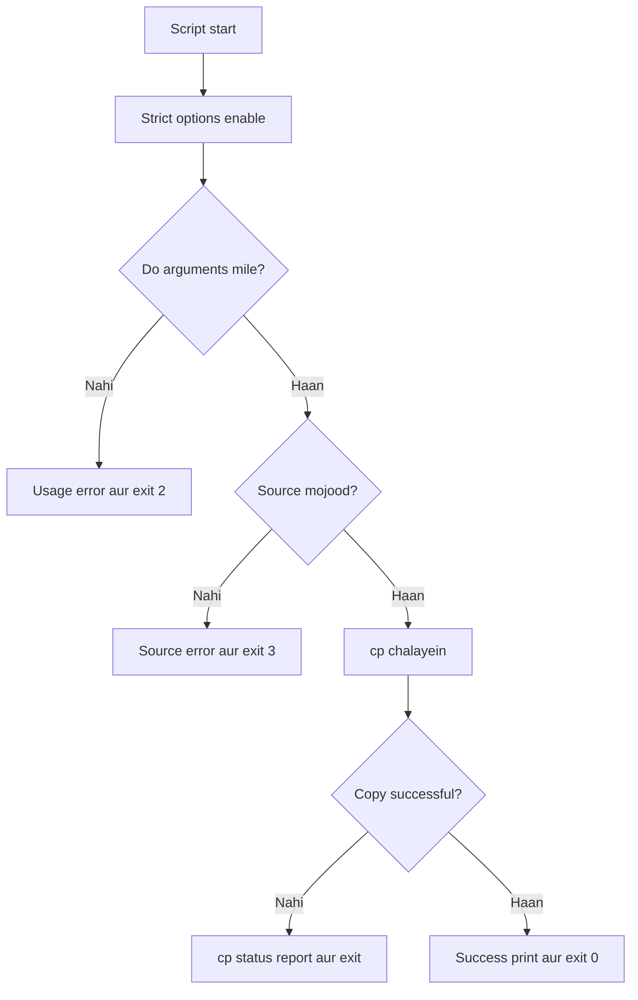

# Bash `set -e` aur Reliable Error Handling — Mukammal Roman Urdu Study Notes

## Table of Contents

1. [Seekhnay ke Maqasid](#1-seekhnay-ke-maqasid)
2. [Exit Status Kya Hai?](#2-exit-status-kya-hai)
3. [`exit 0`, `exit 1` aur Doosray Statuses](#3-exit-0-exit-1-aur-doosray-statuses)
4. [`$?` se Status Check Karna](#4--se-status-check-karna)
5. [`set -e` ka Kya Matlab Hai?](#5-set--e-ka-kya-matlab-hai)
6. [`set -e` ke Baghair aur Sath](#6-set--e-ke-baghair-aur-sath)
7. [`set -e` ki Aham Exceptions](#7-set--e-ki-aham-exceptions)
8. [Pipelines aur `pipefail`](#8-pipelines-aur-pipefail)
9. [Expected Nonzero Results Wali Commands](#9-expected-nonzero-results-wali-commands)
10. [Bash Strict Mode](#10-bash-strict-mode)
11. [Explicit Error Handling](#11-explicit-error-handling)
12. [`return` aur `exit` mein Farq](#12-return-aur-exit-mein-farq)
13. [Functions aur Conditional Context](#13-functions-aur-conditional-context)
14. [Command Substitution aur Subshells](#14-command-substitution-aur-subshells)
15. [`ERR` aur `EXIT` Traps](#15-err-aur-exit-traps)
16. [`set -e` ko Aarzi Tor par Disable Karna](#16-set--e-ko-aarzi-tor-par-disable-karna)
17. [Mukammal Safe Backup Script](#17-mukammal-safe-backup-script)
18. [Testing aur Debugging](#18-testing-aur-debugging)
19. [Aam Ghaltiyan](#19-aam-ghaltiyan)
20. [Best-Practice Checklist](#20-best-practice-checklist)
21. [Practice Lab](#21-practice-lab)
22. [Quick Reference](#22-quick-reference)
23. [Aakhri Khulasa](#23-aakhri-khulasa)

---

## 1. Seekhnay ke Maqasid

In notes ko parhnay ke baad aap:

- Success aur failure exit statuses samajh saken ge.
- `exit`, `return` aur `$?` ko sahi use kar saken ge.
- Bata saken ge ke `set -e` kya karta aur kya nahi karta.
- Woh contexts pehchan saken ge jahan `set -e` script ko foran terminate nahi karta.
- Pipeline ke andar chhupi failure detect kar saken ge.
- `set -Eeuo pipefail` ko samajh kar use kar saken ge.
- Aham commands ko `if`, `else`, `&&` aur `||` se explicitly handle kar saken ge.
- Useful errors ko `stderr` par bhej saken ge.
- Diagnostics aur cleanup ke liye traps use kar saken ge.
- Success aur failure dono execution paths test kar saken ge.

Sab se aham principle:

> `set -e` ko safety net samjhein, mukammal error-handling system nahi.

---

## 2. Exit Status Kya Hai?

Har Bash command, function, pipeline aur script complete honay par aik numeric status deti hai.

| Status | Aam matlab |
|---:|---|
| `0` | Success ya true |
| Nonzero | Failure, false ya command ki koi doosri defined condition |
| `1` | Aam tor par general failure |

Misaal:

```bash
ls /etc/passwd
echo "$?"
```

Successful `ls` aam tor par `0` return karta hai.

```bash
ls /file-that-does-not-exist
echo "$?"
```

Failed `ls` nonzero status return karta hai.

### Nonzero hamesha unexpected error nahi hota

Kuch commands normal conditions batane ke liye bhi nonzero status use karti hain. Misaal ke tor par `grep` ko matching line na milay to woh `1` return karta hai. Yeh error hai ya normal result, iska faisla script ke maqsad par depend karta hai.

Exit statuses calling scripts, cron jobs, systemd services, CI/CD pipelines, deployment tools, monitoring systems aur automation platforms ke liye bohat aham hain.

---

## 3. `exit 0`, `exit 1` aur Doosray Statuses

### `exit 0`

```bash
exit 0
```

Yeh poori script terminate karke successful completion report karta hai.

Create `successful_backup.sh`

```bash
#!/bin/bash

echo "Backup completed successfully."
exit 0
```

### `exit 1`

```bash
exit 1
```

Yeh poori script terminate karke general failure report karta hai.

Create `source_file_check.sh`

```bash
#!/bin/bash

source_file="missing.txt"

if [[ ! -f "$source_file" ]]; then
    echo "Error: source file does not exist." >&2
    exit 1
fi

echo "File exists."
exit 0
```

### Custom statuses

Create `directory_argument_validator.sh`

```bash
#!/bin/bash

if (( $# != 1 )); then
    echo "Error: one directory is required." >&2
    exit 2
fi

if [[ ! -d "$1" ]]; then
    echo "Error: directory does not exist: $1" >&2
    exit 3
fi

echo "Directory is valid."
exit 0
```

| Status | Script ka defined matlab |
|---:|---|
| `0` | Success |
| `1` | General failure |
| `2` | Ghalat arguments |
| `3` | Directory mojood nahi |

Custom meanings ko script help ya README mein document karein. Exit status ki range `0` se `255` hoti hai. Zaroorat ke baghair bohat se custom codes na banayein.

### Help request aam tor par success hoti hai

Create `help_option_demo.sh`

```bash
if [[ "${1:-}" == "--help" || "${1:-}" == "-h" ]]; then
    echo "Usage: $0 SOURCE DESTINATION"
    exit 0
fi
```

Agar usage missing required input ki wajah se dikhayi ja rahi ho to failure zyada munasib hai:

Create `required_arguments_check.sh`

```bash
if (( $# != 2 )); then
    echo "Usage: $0 SOURCE DESTINATION" >&2
    exit 2
fi
```

### `exit` ke baad wali commands nahi chaltin

Create `exit_stops_execution.sh`

```bash
echo "Before exit"
exit 1
echo "After exit"
```

Sirf `Before exit` print hoga.

### Agar explicit `exit` na ho

Script end tak pohanch jaye to aam tor par uska status aakhri executed command ka status hota hai.

Create `implicit_exit_status.sh`

```bash
#!/bin/bash

echo "Completed"
```

`echo` aam tor par succeed karta hai, is liye script normally `0` return karegi. Explicit final status niyyat ko zyada clear karta hai.

---

## 4. `$?` se Status Check Karna

`$?` sab se recent foreground command, script ya pipeline ka status rakhta hai.

```bash
bash backup.sh
echo "$?"
```

Status ko foran check ya save karein, kyun ke har agla command is value ko replace kar deta hai.

Ghalat:

```bash
bash backup.sh
echo "Script finished"
echo "$?"
```

Yahan final status `backup.sh` ka nahi, pehlay `echo` ka hoga.

Sahi:

```bash
bash backup.sh
status=$?

echo "Backup status: $status"
```

Command ko directly test karna aksar zyada clean hota hai:

Create `backup_status_check.sh`

```bash
if bash backup.sh; then
    echo "The backup script succeeded."
else
    echo "The backup script failed." >&2
fi
```

---

## 5. `set -e` ka Kya Matlab Hai?

```bash
set -e
```

Is option ko `errexit` bhi kehtay hain. Long form:

```bash
set -o errexit
```

Beginner-friendly matlab:

> Agar koi unhandled command nonzero status ke sath fail ho, to Bash script ko continue karnay ke bajaye terminate kar sakta hai.

Yahan **kar sakta hai** bohat aham hai. `set -e` context-sensitive hai aur iski kai exceptions hain.

Zyada accurate definition:

> `set -e` Bash syntax aur execution context ke mutabiq kuch unhandled nonzero statuses par react karta hai.

`set -e` har failure catch nahi karta, clear business error message nahi banata, input validate nahi karta, retry ya rollback nahi karta, temporary resources khud clean nahi karta aur testing ka replacement nahi hai.

---

## 6. `set -e` ke Baghair aur Sath

### `set -e` ke baghair

Create `copy_without_errexit.sh`

```bash
#!/bin/bash

echo "Before copy"
cp missing.txt backup.txt
echo "After copy"
```

Possible output:

```text
Before copy
cp: cannot stat 'missing.txt': No such file or directory
After copy
```

Copy fail honay ke bawajood Bash agla command chala deta hai. Is se false success ka impression mil sakta hai.

### `set -e` ke sath

Create `copy_with_errexit.sh`

```bash
#!/bin/bash

set -e

echo "Before copy"
cp missing.txt backup.txt
echo "After copy"
```

Agar `cp` simple aur unhandled command ke tor par fail ho to Bash final `echo` se pehlay terminate kar dega.

### Safety mein madad

Create `safe_project_directory.sh`

```bash
#!/bin/bash

set -e

cd /required/project/directory
touch build-output.txt
```

Agar `cd` fail ho to file ghalat directory mein create honay se pehlay script ruk jati hai. Lekin destructive operations se pehlay sirf `set -e` par bharosa na karein. Exact target ko explicitly validate karein.

---

## 7. `set -e` ki Aham Exceptions

Jab command ka status decision, inversion ya control flow ke liye use ho raha ho, `set -e` aam tor par shell ko foran terminate nahi karta.

### 7.1 `if` ke andar tested command

Create `conditional_copy_check.sh`

```bash
if cp -- "$source" "$destination"; then
    echo "Copy completed."
else
    echo "Copy failed." >&2
fi
```

`if` ko branch select karnay ke liye `cp` ka status chahiye, is liye failure decision ka hissa hai.

### 7.2 `!` se inverted command

Create `negated_directory_creation.sh`

```bash
if ! mkdir "$directory"; then
    echo "Error: directory could not be created." >&2
fi
```

`!` success aur failure ko reverse karta hai aur `if` result handle karta hai.

### 7.3 OR list

Create `mkdir_or_message.sh`

```bash
mkdir "$directory" || echo "Directory creation failed." >&2
```

Left command ki failure decide karti hai ke right command chalna chahiye ya nahi.

Required operation ke liye explicitly exit karein:

Create `required_directory_creation.sh`

```bash
mkdir "$directory" || {
    echo "Error: directory could not be created." >&2
    exit 1
}
```

AND/OR list mein non-final command ka status control flow ke liye use hota hai. Final command ki failure phir bhi poori list ko fail kar sakti aur `errexit` ke liye qualify kar sakti hai.

### 7.4 AND list

Create `mkdir_and_success_message.sh`

```bash
mkdir "$directory" && echo "Directory created."
```

Pehla status decide karta hai ke doosra command chalega ya nahi. Complex workflows mein full `if` block zyada asan aur clear hota hai.

### 7.5 Loop conditions

`while` aur `until` ki condition mein command ka nonzero hona loop ko stop karne ke liye normal ho sakta hai.

Create `read_input_lines.sh`

```bash
while read -r line
do
    echo "$line"
done < input.txt
```

End-of-file par `read` nonzero return karta hai aur loop khatam hota hai. Yeh zaroori nahi ke script error ho.

### 7.6 Pipeline ki non-final commands

`pipefail` ke baghair pehlay command ki failure successful final command ke peechay chhup sakti hai.

### Core lesson

> Decision ke liye use honay wala nonzero status, unhandled standalone failure se mukhtalif hai.

---

## 8. Pipelines aur `pipefail`

```bash
grep "ERROR" missing.log | wc -l
```

Default tor par pipeline ka status aam tor par aakhri command ka status hota hai. `grep` fail ho sakta hai lekin `wc` succeed kar jaye, jis se poori pipeline successful nazar aa sakti hai.

`pipefail` enable karein:

```bash
set -o pipefail
```

`pipefail` ke sath kisi bhi component ki failure pipeline ko nonzero banati hai. Zyada precisely, pipeline rightmost failed component ka status deti hai; tamam commands successful hon to `0` deti hai.

[for log file w/ERROR click here](../data/application.log)

[for log file w/ERROR click here](../data/application_noerror.log)

Create `count_error_lines.sh`

```bash
#!/bin/bash

# Title: Count Error Lines
# Purpose: Count ERROR entries in a log file.

set -e
set -o pipefail

log_file="$1"

grep "ERROR" "$log_file" | wc -l
echo "Pipeline completed."
```

Agar `grep` file open na kar sakay to final message nahi chalega.

### `PIPESTATUS` se har component check karein

Create `pipeline_status_report.sh`

```bash
grep "ERROR" application.log | sort | uniq
statuses=("${PIPESTATUS[@]}")

echo "grep: ${statuses[0]}"
echo "sort: ${statuses[1]}"
echo "uniq: ${statuses[2]}"
```

`$?` ki tarah `PIPESTATUS` ko bhi foran capture karna chahiye.

---

## 9. Expected Nonzero Results Wali Commands

Har nonzero status par script ko stop nahi hona chahiye.

### `grep` status meanings

| Status | Matlab |
|---:|---|
| `0` | Kam az kam aik match mila. |
| `1` | Koi match nahi mila. |
| `1` se bara | Processing error hua. |

Create `grep_status_handler.sh`

```bash
if grep -q "ERROR" application.log; then
    echo "ERROR entry found."
else
    status=$?

    if [[ "$status" -eq 1 ]]; then
        echo "No ERROR entry found."
    else
        echo "Error: grep failed with status $status." >&2
        exit "$status"
    fi
fi
```

Har command ke nonzero status ka matlab uski documentation se check karein.

---

## 10. Bash Strict Mode

Common safety combination:

```bash
set -Eeuo pipefail
```

| Option | Long form | Maqsad |
|---|---|---|
| `-e` | `errexit` | Kuch unhandled failures par react karta hai. |
| `-E` | `errtrace` | `ERR` trap ko zyada contexts mein inherit karwata hai. |
| `-u` | `nounset` | Unset variable ki expansion ko error samajhta hai. |
| `-o pipefail` | `pipefail` | Pipeline ki earlier failure ko expose karta hai. |

### `set -u` aur optional arguments

`set -u` ke sath unset positional parameter ko directly read karna script rok sakta hai:

```bash
source_file="$1"
```

Safe default aur validation use karein:

Create `source_argument_validator.sh`

```bash
source_file="${1:-}"

if [[ -z "$source_file" ]]; then
    echo "Usage: $0 SOURCE_FILE" >&2
    exit 2
fi
```
[source_file="${1:-}" Explanation in roman Urdu](md/bash_parameter_expansion_roman_urdu.md)

[source_file="${1:-}" Explanatio ](md/bash_parameter_expansion_english.md)


Strict options failure visibility improve karti hain, lekin har option ki exceptions aur side effects hain. Success, expected-nonzero aur real-failure paths test karein.

---

## 11. Explicit Error Handling

### Sirf automatic termination

Create `automatic_copy_failure.sh`

```bash
set -e
cp -- "$source" "$destination"
```

Yeh script ko rok sakta hai lekin operation-specific context nahi deta.

### `if` ke sath clear handling

Create `explicit_copy_error_handler.sh`

```bash
if cp -- "$source" "$destination"; then
    echo "Backup completed."
else
    status=$?
    echo "Error: backup failed with status $status." >&2
    exit "$status"
fi
```

Is approach mein success sirf verified success ke baad print hoti hai, failing operation identify hota hai, original status preserve hota hai aur recovery ya cleanup add ki ja sakti hai.

### Quotes aur `--`

```bash
cp -- "$source" "$destination"
```

Quotes spaces walay path ko aik argument rakhti hain. `--` batata hai ke command options khatam ho gaye, is liye `-report.txt` jaisa filename option nahi samjha jata.

### Errors ko `stderr` par bhejna

```bash
echo "Error: backup failed." >&2
```

| Stream | Descriptor | Maqsad |
|---|---:|---|
| stdin | `0` | Input |
| stdout | `1` | Normal output |
| stderr | `2` | Errors aur diagnostics |

```bash
./backup.sh > output.log 2> error.log
```

### `if ! command` ki aham detail

Create `negated_copy_check.sh`

```bash
if ! cp -- "$source" "$destination"; then
    echo "Error: backup failed." >&2
    exit 1
fi
```

Jab sirf success ya failure matter karti ho to yeh useful hai. Lekin `then` block mein `$?` original `cp` status preserve nahi karta, kyun ke `!` ne result invert kar diya hai.

Original status chahiye ho to `if/else` use karein:

Create `preserve_copy_status.sh`

```bash
if cp -- "$source" "$destination"; then
    echo "Backup completed."
else
    status=$?
    echo "Error: cp returned $status." >&2
    exit "$status"
fi
```

---

## 12. `return` aur `exit` mein Farq

Practical farq:

> `return` function ya sourced file se bahar nikalta hai; `exit` poori script ya shell process terminate karta hai.

| Command | Current function end? | Poori script end? | Status |
|---|---:|---:|---:|
| `return 0` | Haan | Nahi | Success |
| `return 1` | Haan | Nahi | Failure |
| `exit 0` | Haan | Haan | Success |
| `exit 1` | Haan | Haan | Failure |

### Reusable function

Create `reusable_file_check.sh`

```bash
check_file()
{
    local file="$1"

    if [[ ! -f "$file" ]]; then
        echo "Error: file does not exist: $file" >&2
        return 1
    fi

    echo "File exists: $file"
    return 0
}
```

Caller decide karta hai ke poori script rokni hai ya nahi:

```bash
if ! check_file "report.txt"; then
    echo "The script cannot continue." >&2
    exit 1
fi

echo "Continue with the next task."
```

### Memory rule

> Function se `return`; script se `exit`.

Normally `return` function ke andar use hota hai. Sourced file mein bhi `return` use karke us file ki processing roki ja sakti hai baghair current shell terminate kiye.

---

## 13. Functions aur Conditional Context

Jab function conditional context mein call ho to `set -e` ka behavior zyada subtle ho jata hai.

Reusable function mein clear status return karein:

Create `backup_function_demo.sh`

```bash
create_backup()
{
    local source="$1"
    local destination="$2"

    if cp -- "$source" "$destination"; then
        echo "Backup completed."
        return 0
    else
        status=$?
        echo "Error: backup failed with status $status." >&2
        return "$status"
    fi
}
```

Master flow final decision kare:

```bash
if ! create_backup "report.txt" "backup/report.txt"; then
    echo "Stopping because the backup failed." >&2
    exit 1
fi
```

Agar poora function call `if`, `!`, `&&` ya `||` ki condition ho to function ke andar `errexit` behavior surprising ho sakta hai. Yeh assume na karein ke har internal failure script ko lazmi terminate karegi. Critical functions mein statuses explicitly return karein.

---

## 14. Command Substitution aur Subshells

### Command substitution

```bash
result=$(some_command)
```

Command substitution ke andar `errexit` behavior Bash mode aur `inherit_errexit` setting par depend kar sakta hai. Critical substitution ko explicitly handle karein:

Create `command_substitution_handler.sh`

```bash
if result=$(some_command); then
    echo "Result: $result"
else
    status=$?
    echo "Error: command substitution failed with status $status." >&2
    exit "$status"
fi
```

Is se intended behavior clear rehta hai aur subtle inheritance rules par depend nahi karta.

### Subshell

Parentheses ke andar commands subshell mein chalti hain:

Create `subshell_errexit_demo.sh`

```bash
(
    set -e
    cd /required/directory
    run_task
)
```

Option aur directory changes usi subshell tak mehdood rehtay hain. Parent shell ko subshell ka final status milta hai.

---

## 15. `ERR` aur `EXIT` Traps

[TRAP in detail click here in roman Urdu](md/Bash-Trap-Command-Study-Notes-Roman-Urdu.md)

[TRAP in detail click here](md/Bash-Trap-Command-Study-Notes.md)

### Diagnostics ke liye `ERR` trap

Create `err_trap_diagnostics.sh`

```bash
set -Eeuo pipefail

trap 'status=$?; echo "Error: command failed near line $LINENO with status $status." >&2' ERR
```

`-E`, `ERR` trap ko zyada contexts mein inherit karwata hai.

Aham limitations:

- `ERR` bhi `set -e` jaisi kai context rules follow karta hai.
- Yeh operation-specific error messages ka replacement nahi.
- Isay final diagnostic safety net samjhein.
- Complex traps ko dhyan se test karein.

### Cleanup ke liye `EXIT` trap

Create `temporary_file_cleanup.sh`

```bash
temp_file=""

cleanup()
{
    if [[ -n "${temp_file:-}" ]]; then
        rm -f -- "$temp_file"
    fi
}

trap cleanup EXIT

temp_file=$(mktemp)
```

`EXIT` trap normal exit aur aksar script failures par shell terminate honay se pehlay chalta hai. Yeh temporary files, locks aur doosray resources clean karne ke liye useful hai.

### Cleanup mein original status preserve karna

Create `cleanup_preserve_status.sh`

```bash
cleanup()
{
    local status=$?

    if [[ -n "${temp_file:-}" ]]; then
        rm -f -- "$temp_file"
    fi

    return "$status"
}

trap cleanup EXIT
```

---

## 16. `set -e` ko Aarzi Tor par Disable Karna

Enable:

```bash
set -e
```

Disable:

```bash
set +e
```

Dobara enable:

```bash
set -e
```

Misaal:

Create `temporary_errexit_disable.sh`

```bash
set +e
some_command_that_may_fail
status=$?
set -e

echo "Command status: $status"
```

Agar script option dobara enable karna bhool jaye to yeh fragile ho sakta hai. Explicit conditional aam tor par zyada clear hota hai:

Create `expected_failure_handler.sh`

```bash
if some_command_that_may_fail; then
    echo "Command succeeded."
else
    status=$?
    echo "Command returned status $status." >&2
fi
```

---

## 17. Mukammal Safe Backup Script

Script name: `safe_backup.sh`

```bash
#!/bin/bash

# Title: Safe Backup
# Purpose: Copy one source path to a destination with clear error handling.
# Usage: ./safe_backup.sh SOURCE DESTINATION

set -Eeuo pipefail

trap 'status=$?; echo "Unexpected error near line $LINENO; status: $status" >&2' ERR

source_path="${1:-}"
destination="${2:-}"

if (( $# != 2 )); then
    echo "Usage: $0 SOURCE DESTINATION" >&2
    exit 2
fi

if [[ ! -e "$source_path" ]]; then
    echo "Error: source does not exist: $source_path" >&2
    exit 3
fi

if cp -- "$source_path" "$destination"; then
    echo "Backup completed: $source_path -> $destination"
else
    status=$?
    echo "Error: backup failed with status $status." >&2
    exit "$status"
fi

exit 0
```

### Script flow



### Yeh script reliable kyun hai?

- Strict options additional safety net provide karti hain.
- `${1:-}` aur `${2:-}`, `set -u` ke sath safe hain.
- Copy se pehlay arguments aur source validate hotay hain.
- Paths quoted hain.
- `--` option jaisay filenames ko protect karta hai.
- `if`, `cp` ko directly check karta hai.
- Errors `stderr` par jatay hain.
- Success sirf `cp` succeed honay ke baad print hoti hai.
- Original `cp` failure status preserve hota hai.

---

## 18. Testing aur Debugging

### Execute kiye baghair syntax check

```bash
bash -n safe_backup.sh
```

Koi output na ana aam tor par batata hai ke Bash ko syntax error nahi mila.

### Execution trace

```bash
bash -x safe_backup.sh report.txt backup.txt
```

Tracing expanded commands ko execution ke waqt dikhati hai. Ehtiyat karein: variables mein rakhe secrets bhi display ho saktay hain.

### Test matrix

| Test | Misaal | Expected result |
|---|---|---|
| Missing arguments | `bash safe_backup.sh` | Usage aur nonzero status |
| Missing source | `bash safe_backup.sh missing.txt backup.txt` | Source error |
| Valid source | `bash safe_backup.sh report.txt backup.txt` | Successful copy |
| Destination denied | Unwritable location mein copy | `cp` error aur nonzero status |
| Spaces wala path | `"my report.txt"` use karein | Path aik argument rahe |
| Option jaisa filename | `-` se shuru file | `--` option parsing rokay |

Status foran check karein:

```bash
bash safe_backup.sh report.txt backup.txt
status=$?
echo "Script status: $status"
```

Success aur failure dono paths test karein. Jo script sirf success par test hui ho, woh mukammal test nahi hui.

---

## 19. Aam Ghaltiyan

### Ghalti 1: Kehna ke `set -e` har failure par exit karta hai

Yeh context-sensitive hai. Conditions, negation, AND/OR lists, loops, pipelines, functions aur substitutions mein rules mukhtalif ho saktay hain.

### Ghalti 2: `set -e` ko complete error handling samajhna

Yeh clear context, recovery, retry, rollback ya cleanup automatically provide nahi karta.

### Ghalti 3: `pipefail` bhool jana

```bash
set -e
command1 | command2
```

Earlier failure successful final command ke peechay chhup sakti hai.

### Ghalti 4: Har nonzero status ko unexpected samajhna

Misaal ke tor par `grep` status `1` ka matlab no match hai, jo normal bhi ho sakta hai.

### Ghalti 5: Unchecked command ke baad success print karna

```bash
cp "$source" "$destination"
echo "Backup completed."
```

`set -e` active na ho ya apply na kare to failed copy ke baad bhi message chal sakta hai.

### Ghalti 6: `$?` dair se check karna

Har subsequent command `$?` ko change karta hai. Foran save karein ya command directly test karein.

### Ghalti 7: `!` ke baad original `$?` capture karna

`!` status reverse karta hai. Original status ke liye `if command; then ... else status=$? ... fi` use karein.

### Ghalti 8: Reusable function mein ghalti se `exit` use karna

`exit` poori script terminate karta hai. Sirf function rokna ho to `return` use karein.

### Ghalti 9: Cleanup bhool jana

Temporary resources ko success aur failure dono par remove karne ke liye `EXIT` trap use karein.

### Ghalti 10: Strict mode ko destructive commands ki guarantee samajhna

Strict mode ghalat target path ya flawed business logic sahi nahi kar sakta. Destructive action se pehlay exact target resolve aur validate karein.

---

## 20. Best-Practice Checklist

- [ ] Bash features ke liye Bash shebang use karein.
- [ ] Safety options script ke start ke qareeb rakhein.
- [ ] Har enabled option ka behavior samjhein.
- [ ] Meaningful pipelines ke liye `pipefail` use karein.
- [ ] Arguments aur user input validate karein.
- [ ] Paths aur user data wali expansions quote karein.
- [ ] Supported commands mein user paths se pehlay `--` use karein.
- [ ] Critical commands explicitly handle karein.
- [ ] Errors aur diagnostics `stderr` par bhejein.
- [ ] Accurate statuses return karein.
- [ ] Functions mein `return` aur master script mein `exit` use karein.
- [ ] Expected nonzero results deliberately handle karein.
- [ ] Zaroorat par diagnostics aur cleanup traps use karein.
- [ ] Execution se pehlay `bash -n` chalayein.
- [ ] Success, expected-negative aur genuine-failure cases test karein.
- [ ] Troubleshooting mein `bash -x` ehtiyat se use karein.

---

## 21. Practice Lab

### Task

`set_e_demo.sh` banayein jo:

1. `set -Eeuo pipefail` use kare.
2. Failed line number report karne ke liye `ERR` trap use kare.
3. `$1` se log filename le.
4. Missing argument reject kare.
5. Missing ya non-regular file reject kare.
6. File mein `ERROR` word search kare.
7. No match ko expected result samjhay.
8. Real `grep` processing error ko failure samjhay.
9. Valid search ke baad `exit 0` de.

### Suggested solution

Script name: `set_e_demo.sh`

```bash
#!/bin/bash

set -Eeuo pipefail

trap 'status=$?; echo "Unexpected error near line $LINENO; status: $status" >&2' ERR

source_file="${1:-}"

if [[ -z "$source_file" ]]; then
    echo "Usage: $0 SOURCE_FILE" >&2
    exit 2
fi

if [[ ! -f "$source_file" ]]; then
    echo "Error: source is not a regular file: $source_file" >&2
    exit 3
fi

if grep -q "ERROR" "$source_file"; then
    echo "ERROR entry found."
else
    status=$?

    if [[ "$status" -eq 1 ]]; then
        echo "No ERROR entry found."
    else
        echo "Error: grep failed with status $status." >&2
        exit "$status"
    fi
fi

exit 0
```

### Test data banayein

```bash
echo "INFO: application started" > application.log
bash set_e_demo.sh application.log
```

Matching line add karein:

```bash
echo "ERROR: database unavailable" >> application.log
bash set_e_demo.sh application.log
```

Missing file test karein:

```bash
bash set_e_demo.sh missing.log
echo "$?"
```

---

## 22. Quick Reference

| Syntax | Matlab |
|---|---|
| `set -e` | Kuch unhandled failures ke liye `errexit` enable karta hai. |
| `set -o errexit` | `errexit` enable karne ki long form. |
| `set +e` | `errexit` disable karta hai. |
| `set -u` | Unset variable expansion ko error samajhta hai. |
| `set -o pipefail` | Pipeline component ki failure expose karta hai. |
| `set -E` | `ERR` trap ko zyada contexts mein inherit karta hai. |
| `set -Eeuo pipefail` | Common strict safety combination. |
| `$?` | Recent foreground command ya pipeline ka status. |
| `${PIPESTATUS[@]}` | Recent foreground pipeline ke tamam component statuses. |
| `exit N` | Poori script ko status `N` ke sath end karta hai. |
| `return N` | Function ya sourced file ko status `N` ke sath chhorta hai. |
| `if command; then` | Command `0` de to `then` chalata hai. |
| `if ! command; then` | Command nonzero de to `then` chalata hai. |
| `command1 && command2` | Command 1 succeed ho to command 2 chalata hai. |
| `command1 || command2` | Command 1 fail ho to command 2 chalata hai. |
| `>&2` | Output ko standard error par bhejta hai. |
| `trap '...' ERR` | Qualifying error par diagnostic logic chalata hai. |
| `trap cleanup EXIT` | Shell exit par cleanup chalata hai. |
| `bash -n script.sh` | Normal execution ke baghair syntax check karta hai. |
| `bash -x script.sh` | Execution ke waqt commands trace karta hai. |

---

## 23. Aakhri Khulasa

`set -e` ka simplified matlab:

```bash
set -e
```

> Jab unhandled command failure `errexit` rules ke liye qualify kare to script rok dein.

Yaad rakhein:

- `0` aam tor par success hai.
- Nonzero failure ya doosri documented condition hoti hai.
- `set -e` ki context-dependent exceptions hain.
- `pipefail` pipelines ke andar chhupi failures expose karta hai.
- `set -u` unset-variable expansion catch karta hai.
- `set -E`, `ERR` trap inheritance improve karta hai.
- Expected nonzero statuses intentionally handle karne chahiye.
- `return` function chhorta hai; `exit` script end karta hai.
- Explicit `if/else` clear errors aur recovery points deta hai.
- `EXIT` traps temporary resources clean karne mein madad karti hain.
- Syntax checks aur failure-path tests lazmi hain.

Recommended mindset:

```text
set -e            = additional safety net
explicit if/else = clear aur intentional error handling
trap EXIT        = dependable cleanup point
testing          = design ke kaam karne ka proof
```

Final rule:

> Sirf `set -e` par depend na karein. Critical operations validate karein, useful errors report karein, resources clean karein aur accurate statuses return karein.
