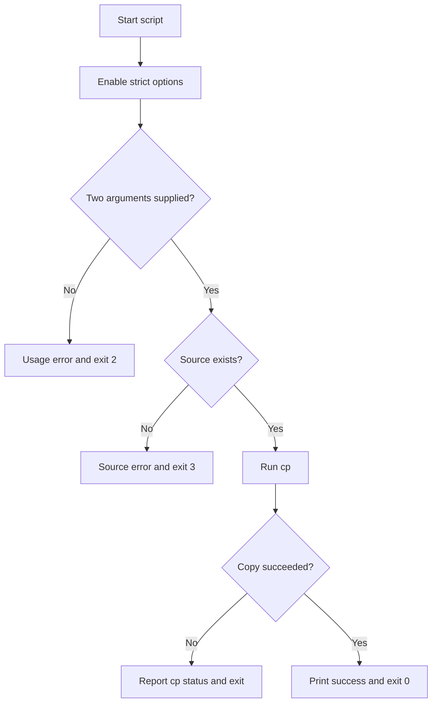

# Bash `set -e` and Reliable Error Handling — Complete Study Notes

## Table of Contents

1. [Learning Objectives](#1-learning-objectives)
2. [What Is an Exit Status?](#2-what-is-an-exit-status)
3. [`exit 0`, `exit 1`, and Other Statuses](#3-exit-0-exit-1-and-other-statuses)
4. [Checking a Status with `$?`](#4-checking-a-status-with-)
5. [What Does `set -e` Mean?](#5-what-does-set--e-mean)
6. [Without and With `set -e`](#6-without-and-with-set--e)
7. [Important `set -e` Exceptions](#7-important-set--e-exceptions)
8. [Pipelines and `pipefail`](#8-pipelines-and-pipefail)
9. [Commands with Expected Nonzero Results](#9-commands-with-expected-nonzero-results)
10. [Bash Strict Mode](#10-bash-strict-mode)
11. [Explicit Error Handling](#11-explicit-error-handling)
12. [`return` Versus `exit`](#12-return-versus-exit)
13. [Functions and Conditional Context](#13-functions-and-conditional-context)
14. [Command Substitution and Subshells](#14-command-substitution-and-subshells)
15. [`ERR` and `EXIT` Traps](#15-err-and-exit-traps)
16. [Temporarily Disabling `set -e`](#16-temporarily-disabling-set--e)
17. [Complete Safe Backup Script](#17-complete-safe-backup-script)
18. [Testing and Debugging](#18-testing-and-debugging)
19. [Common Mistakes](#19-common-mistakes)
20. [Best-Practice Checklist](#20-best-practice-checklist)
21. [Practice Lab](#21-practice-lab)
22. [Quick Reference](#22-quick-reference)
23. [Final Summary](#23-final-summary)

---

## 1. Learning Objectives

After studying these notes, you should be able to:

- Explain success and failure exit statuses.
- Use `exit`, `return`, and `$?` correctly.
- Explain what `set -e` does and does not do.
- Recognize contexts where `set -e` does not immediately terminate a script.
- Detect failures hidden inside pipelines.
- Use `set -Eeuo pipefail` thoughtfully.
- Handle important commands explicitly with `if`, `else`, `&&`, or `||`.
- Report useful errors through `stderr`.
- Use traps for diagnostics and cleanup.
- Test both successful and unsuccessful execution paths.

The most important principle is:

> Use `set -e` as a safety net, not as a replacement for deliberate error handling.

---

## 2. What Is an Exit Status?

Every Bash command, function, pipeline, and script finishes with a numeric status.

| Status | General meaning |
|---:|---|
| `0` | Success or true |
| Nonzero | Failure, false, or another command-defined condition |
| `1` | Commonly used for general failure |

Examples:

```bash
ls /etc/passwd
echo "$?"
```

A successful `ls` normally returns `0`.

```bash
ls /file-that-does-not-exist
echo "$?"
```

The failed `ls` returns a nonzero status.

### Nonzero does not always mean an unexpected error

Some commands use nonzero statuses to communicate normal conditions. For example, `grep` returns `1` when no matching line is found. Whether that is an error depends on the purpose of the script.

Exit statuses are important to calling scripts, cron jobs, systemd services, CI/CD pipelines, deployment tools, monitoring systems, and automation platforms.

---

## 3. `exit 0`, `exit 1`, and Other Statuses

### `exit 0`

```bash
exit 0
```

This terminates the complete script and reports successful completion.

Create:  `successful_backup.sh`

```bash
#!/bin/bash

echo "Backup completed successfully."
exit 0
```

### `exit 1`

```bash
exit 1
```

This terminates the complete script and reports general failure.

Create:  `source_file_check.sh`

```bash
#!/bin/bash

source_file="missing.txt"

if [[ ! -f "$source_file" ]]; then
    echo "Error: source file does not exist." >&2
    exit 1
fi

echo "File exists."
exit 0
```

### Custom statuses

Create:  `directory_argument_validator.sh`

```bash
#!/bin/bash

if (( $# != 1 )); then
    echo "Error: one directory is required." >&2
    exit 2
fi

if [[ ! -d "$1" ]]; then
    echo "Error: directory does not exist: $1" >&2
    exit 3
fi

echo "Directory is valid."
exit 0
```

| Status | Script-defined meaning |
|---:|---|
| `0` | Success |
| `1` | General failure |
| `2` | Incorrect arguments |
| `3` | Directory does not exist |

Document custom meanings in the script help or README. Exit statuses are represented in the range `0` through `255`; avoid inventing many codes unless they provide real value.

### Help is usually successful

Create:  `help_option_demo.sh`

```bash
if [[ "${1:-}" == "--help" || "${1:-}" == "-h" ]]; then
    echo "Usage: $0 SOURCE DESTINATION"
    exit 0
fi
```

When usage is displayed because required input is missing, failure is more appropriate:

Create:  `required_arguments_check.sh`

```bash
if (( $# != 2 )); then
    echo "Usage: $0 SOURCE DESTINATION" >&2
    exit 2
fi
```

### Commands after `exit` do not run

Create:  `exit_stops_execution.sh`

```bash
echo "Before exit"
exit 1
echo "After exit"
```

Only `Before exit` is printed.

### No explicit `exit`

If a script reaches its end, its status is normally the status of the last command that ran.

Create:  `implicit_exit_status.sh`

```bash
#!/bin/bash

echo "Completed"
```

Because `echo` normally succeeds, this script normally returns `0`. An explicit final status can make the intended result clearer.

---

## 4. Checking a Status with `$?`

`$?` contains the status of the most recently completed foreground command, script, or pipeline.

```bash
bash backup.sh
echo "$?"
```

Check or save it immediately because every following command replaces it.

Incorrect:

```bash
bash backup.sh
echo "Script finished"
echo "$?"
```

The displayed status belongs to `echo "Script finished"`, not to `backup.sh`.

Correct:

```bash
bash backup.sh
status=$?

echo "Backup status: $status"
```

A direct conditional is often cleaner:

Create:  `backup_status_check.sh`

```bash
if bash backup.sh; then
    echo "The backup script succeeded."
else
    echo "The backup script failed." >&2
fi
```

---

## 5. What Does `set -e` Mean?

```bash
set -e
```

The option is also called `errexit` and can be enabled with:

```bash
set -o errexit
```

A useful beginner definition is:

> If an unhandled command fails with a nonzero status, Bash may terminate the script instead of continuing.

The word **may** matters. `set -e` is context-sensitive and has several exceptions.

It is more accurate to say:

> `set -e` reacts to certain unhandled nonzero statuses according to Bash's syntax and execution context.

It does not catch every possible failure, explain which business operation failed, validate input, retry commands, roll back partial changes, clean temporary resources automatically, or replace testing.

---

## 6. Without and With `set -e`

### Without `set -e`

Create:  `copy_without_errexit.sh`

```bash
#!/bin/bash

echo "Before copy"
cp missing.txt backup.txt
echo "After copy"
```

Possible output:

```text
Before copy
cp: cannot stat 'missing.txt': No such file or directory
After copy
```

Bash continues even though the copy failed. A later message might create a false impression of success.

### With `set -e`

Create:  `copy_with_errexit.sh`

```bash
#!/bin/bash

set -e

echo "Before copy"
cp missing.txt backup.txt
echo "After copy"
```

If `cp` fails as a simple, unhandled command, Bash terminates before the final `echo`.

### Why it can improve safety

Create:  `safe_project_directory.sh`

```bash
#!/bin/bash

set -e

cd /required/project/directory
touch build-output.txt
```

If `cd` fails, the script stops before creating the file in the wrong directory. However, do not treat `set -e` as the only protection before destructive operations. Validate the target explicitly and avoid broad, unresolved paths.

---

## 7. Important `set -e` Exceptions

`set -e` normally does not immediately terminate the shell when a command's status is intentionally being tested, inverted, or used to control a list.

### 7.1 Command tested by `if`

Create:  `conditional_copy_check.sh`

```bash
if cp -- "$source" "$destination"; then
    echo "Copy completed."
else
    echo "Copy failed." >&2
fi
```

`if` needs the status of `cp` to select a branch. The failure is part of decision-making.

### 7.2 Command inverted with `!`

Create:  `negated_directory_creation.sh`

```bash
if ! mkdir "$directory"; then
    echo "Error: directory could not be created." >&2
fi
```

`!` reverses success and failure, and `if` handles the resulting condition.

### 7.3 Commands in an OR list

Create:  `mkdir_or_message.sh`

```bash
mkdir "$directory" || echo "Directory creation failed." >&2
```

Failure of the left command decides whether the right command should run.

In an AND/OR list, a non-final command's status is being used for control flow. The final command in the list can still determine the list's failure and may qualify for `errexit` behavior.

For a required operation, explicitly terminate:

Create:  `required_directory_creation.sh`

```bash
mkdir "$directory" || {
    echo "Error: directory could not be created." >&2
    exit 1
}
```

### 7.4 Commands in an AND list

Create:  `mkdir_and_success_message.sh`

```bash
mkdir "$directory" && echo "Directory created."
```

The first status controls whether the second command runs. `set -e` behavior inside `&&` and `||` lists is not the same as for a standalone command. For complicated workflows, prefer a full `if` block.

### 7.5 Loop conditions

Commands tested by `while` or `until` are expected to become nonzero when the loop should stop.

Create:  `read_input_lines.sh`

```bash
while read -r line
do
    echo "$line"
done < input.txt
```

At end-of-file, `read` returns nonzero to end the loop. This is normal control flow, not necessarily a script error.

### 7.6 Non-final commands in pipelines

Without `pipefail`, failure of an earlier pipeline command can be hidden by a successful final command.

### Core lesson

> A nonzero status used as part of a decision is different from an unhandled standalone failure.

---

## 8. Pipelines and `pipefail`

Consider:

```bash
grep "ERROR" missing.log | wc -l
```

By default, a pipeline's status is normally the status of its final command. `grep` may fail while `wc` still succeeds, so the whole pipeline can appear successful.

Enable `pipefail`:

```bash
set -o pipefail
```

With `pipefail`, a pipeline returns a nonzero status when any component fails. More precisely, it returns the status of the rightmost failed component, or `0` when all components succeed.

Create:  `pipeline_failure_demo.sh`

```bash
#!/bin/bash

set -e
set -o pipefail

grep "ERROR" missing.log | wc -l
echo "Pipeline completed."
```

If `grep` cannot open the file, the pipeline returns nonzero and the final message does not run.

### Inspect every component with `PIPESTATUS`

Create:  `pipeline_status_report.sh`

```bash
grep "ERROR" application.log | sort | uniq
statuses=("${PIPESTATUS[@]}")

echo "grep: ${statuses[0]}"
echo "sort: ${statuses[1]}"
echo "uniq: ${statuses[2]}"
```

Like `$?`, `PIPESTATUS` should be captured immediately.

---

## 9. Commands with Expected Nonzero Results

Not every nonzero status should stop a script.

### `grep` status meanings

| Status | Meaning |
|---:|---|
| `0` | At least one match was found. |
| `1` | No match was found. |
| Greater than `1` | An actual processing error occurred. |

Create:  `grep_status_handler.sh`

```bash
if grep -q "ERROR" application.log; then
    echo "ERROR entry found."
else
    status=$?

    if [[ "$status" -eq 1 ]]; then
        echo "No ERROR entry found."
    else
        echo "Error: grep failed with status $status." >&2
        exit "$status"
    fi
fi
```

Always check a command's documentation instead of assuming that every nonzero value represents the same kind of error.

---

## 10. Bash Strict Mode

A commonly used safety combination is:

```bash
set -Eeuo pipefail
```

| Option | Long form | Purpose |
|---|---|---|
| `-e` | `errexit` | React to certain unhandled command failures. |
| `-E` | `errtrace` | Inherit the `ERR` trap in more functions, substitutions, and subshell contexts. |
| `-u` | `nounset` | Treat expansion of an unset variable as an error. |
| `-o pipefail` | `pipefail` | Expose failures from earlier pipeline components. |

### `set -u` and optional arguments

Under `set -u`, directly reading an unset positional parameter can stop the script:

```bash
source_file="$1"
```

Use a safe default and validate it:

Create:  `source_argument_validator.sh`

```bash
source_file="${1:-}"

if [[ -z "$source_file" ]]; then
    echo "Usage: $0 SOURCE_FILE" >&2
    exit 2
fi
```

Strict options improve failure visibility, but each option has exceptions and side effects. Test successful, expected-nonzero, and genuine-failure paths.

---

## 11. Explicit Error Handling

### Automatic termination only

Create:  `automatic_copy_failure.sh`

```bash
set -e
cp -- "$source" "$destination"
```

This may stop the script, but it does not provide application-specific context.

### Clear handling with `if`

Create:  `explicit_copy_error_handler.sh`

```bash
if cp -- "$source" "$destination"; then
    echo "Backup completed."
else
    status=$?
    echo "Error: backup failed with status $status." >&2
    exit "$status"
fi
```

This prints success only after verified success, identifies the failing operation, preserves its status, and provides a place for recovery or cleanup.

### Quotes and `--`

```bash
cp -- "$source" "$destination"
```

Quotes keep a path containing spaces as one argument. `--` tells `cp` that options have ended, so a filename such as `-report.txt` is treated as a path.

### Send errors to `stderr`

```bash
echo "Error: backup failed." >&2
```

| Stream | Descriptor | Purpose |
|---|---:|---|
| stdin | `0` | Input |
| stdout | `1` | Normal output |
| stderr | `2` | Errors and diagnostics |

```bash
./backup.sh > output.log 2> error.log
```

### Important detail about `if ! command`

Create:  `negated_copy_check.sh`

```bash
if ! cp -- "$source" "$destination"; then
    echo "Error: backup failed." >&2
    exit 1
fi
```

This is useful when only success or failure matters. But `$?` inside the `then` block does not preserve the original `cp` failure status because `!` inverted it.

When the original status matters, use `if/else`:

Create:  `preserve_copy_status.sh`

```bash
if cp -- "$source" "$destination"; then
    echo "Backup completed."
else
    status=$?
    echo "Error: cp returned $status." >&2
    exit "$status"
fi
```

---

## 12. `return` Versus `exit`

The practical difference is:

> `return` leaves a function or sourced file; `exit` terminates the entire script or shell process.

| Command | Ends current function | Ends entire script | Status |
|---|---:|---:|---:|
| `return 0` | Yes | No | Success |
| `return 1` | Yes | No | Failure |
| `exit 0` | Yes | Yes | Success |
| `exit 1` | Yes | Yes | Failure |

### Reusable function

Create:  `reusable_file_check.sh`

```bash
check_file()
{
    local file="$1"

    if [[ ! -f "$file" ]]; then
        echo "Error: file does not exist: $file" >&2
        return 1
    fi

    echo "File exists: $file"
    return 0
}
```

The caller decides whether the complete script should stop:

```bash
if ! check_file "report.txt"; then
    echo "The script cannot continue." >&2
    exit 1
fi

echo "Continue with the next task."
```

### Memory rule

> Return from a function; exit from a script.

Normally, `return` is used inside a function. It may also be used in a sourced file to stop processing that file without terminating the current shell.

---

## 13. Functions and Conditional Context

`set -e` becomes especially subtle when functions are called in a conditional context.

Use explicit statuses inside reusable functions:

Create:  `backup_function_demo.sh`

```bash
create_backup()
{
    local source="$1"
    local destination="$2"

    if cp -- "$source" "$destination"; then
        echo "Backup completed."
        return 0
    else
        status=$?
        echo "Error: backup failed with status $status." >&2
        return "$status"
    fi
}
```

Then let the master flow decide:

```bash
if ! create_backup "report.txt" "backup/report.txt"; then
    echo "Stopping because the backup failed." >&2
    exit 1
fi
```

When an entire function call is used as the condition of `if`, `!`, `&&`, or `||`, Bash's `errexit` behavior within that function can be surprising. Do not assume that a failing internal command will always terminate the script. Make critical functions return clear statuses deliberately.

---

## 14. Command Substitution and Subshells

### Command substitution

```bash
result=$(some_command)
```

The behavior of `errexit` inside command substitution can depend on Bash mode and the `inherit_errexit` setting. Handle a critical substitution explicitly:

Create:  `command_substitution_handler.sh`

```bash
if result=$(some_command); then
    echo "Result: $result"
else
    status=$?
    echo "Error: command substitution failed with status $status." >&2
    exit "$status"
fi
```

This makes the intended behavior clear without depending on option-inheritance details.

### Subshell

Commands inside parentheses run in a subshell:

Create:  `subshell_errexit_demo.sh`

```bash
(
    set -e
    cd /required/directory
    run_task
)
```

The option and directory changes are limited to that subshell. The parent shell receives the subshell's final status.

---

## 15. `ERR` and `EXIT` Traps

### `ERR` trap for diagnostics

Create:  `err_trap_diagnostics.sh`

```bash
set -Eeuo pipefail

trap 'status=$?; echo "Error: command failed near line $LINENO with status $status." >&2' ERR
```

`-E` allows the `ERR` trap to be inherited in more contexts.

Important limitations:

- `ERR` follows many of the same context rules as `set -e`.
- It does not replace operation-specific error messages.
- It should be treated as a final diagnostic safety net.
- Complex trap commands should be tested carefully.

### `EXIT` trap for cleanup

Create:  `temporary_file_cleanup.sh`

```bash
temp_file=""

cleanup()
{
    if [[ -n "${temp_file:-}" ]]; then
        rm -f -- "$temp_file"
    fi
}

trap cleanup EXIT

temp_file=$(mktemp)
```

The `EXIT` trap runs when the shell exits normally or after most script failures. It is useful for temporary files, locks, and other resources that must be removed.

### Preserve the original status during cleanup

Create:  `cleanup_preserve_status.sh`

```bash
cleanup()
{
    local status=$?

    if [[ -n "${temp_file:-}" ]]; then
        rm -f -- "$temp_file"
    fi

    return "$status"
}

trap cleanup EXIT
```

---

## 16. Temporarily Disabling `set -e`

Enable `errexit`:

```bash
set -e
```

Disable it:

```bash
set +e
```

Enable it again:

```bash
set -e
```

Example:

Create:  `temporary_errexit_disable.sh`

```bash
set +e
some_command_that_may_fail
status=$?
set -e

echo "Command status: $status"
```

This can be fragile if the script forgets to re-enable the option. An explicit conditional is normally clearer:

Create:  `expected_failure_handler.sh`

```bash
if some_command_that_may_fail; then
    echo "Command succeeded."
else
    status=$?
    echo "Command returned status $status." >&2
fi
```

---

## 17. Complete Safe Backup Script

Script name: `safe_backup.sh`

```bash
#!/bin/bash

# Title: Safe Backup
# Purpose: Copy one source path to a destination with clear error handling.
# Usage: ./safe_backup.sh SOURCE DESTINATION

set -Eeuo pipefail

trap 'status=$?; echo "Unexpected error near line $LINENO; status: $status" >&2' ERR

source_path="${1:-}"
destination="${2:-}"

if (( $# != 2 )); then
    echo "Usage: $0 SOURCE DESTINATION" >&2
    exit 2
fi

if [[ ! -e "$source_path" ]]; then
    echo "Error: source does not exist: $source_path" >&2
    exit 3
fi

if cp -- "$source_path" "$destination"; then
    echo "Backup completed: $source_path -> $destination"
else
    status=$?
    echo "Error: backup failed with status $status." >&2
    exit "$status"
fi

exit 0
```

### Script flow



### Why this script is reliable

- Strict options provide an additional safety net.
- `${1:-}` and `${2:-}` are safe under `set -u`.
- Argument and source validation happen before copying.
- Paths are quoted.
- `--` protects option-like filenames.
- `if` directly checks `cp`.
- Errors go to `stderr`.
- Success is printed only after `cp` succeeds.
- The original `cp` failure status is preserved.

---

## 18. Testing and Debugging

### Check syntax without executing

```bash
bash -n safe_backup.sh
```

No output normally means no Bash syntax error was found.

### Trace execution

```bash
bash -x safe_backup.sh report.txt backup.txt
```

Tracing prints expanded commands as Bash executes them. Be careful: tracing may expose secrets stored in variables.

### Test matrix

| Test | Example | Expected result |
|---|---|---|
| Missing arguments | `bash safe_backup.sh` | Usage and nonzero status |
| Missing source | `bash safe_backup.sh missing.txt backup.txt` | Source error |
| Valid source | `bash safe_backup.sh report.txt backup.txt` | Successful copy |
| Destination denied | Copy to an unwritable location | `cp` error and nonzero status |
| Path with spaces | Use `"my report.txt"` | Path remains one argument |
| Option-like filename | Use a file beginning with `-` | `--` prevents option parsing |

Check status immediately:

```bash
bash safe_backup.sh report.txt backup.txt
status=$?
echo "Script status: $status"
```

Test both successful and failure paths. A script that has only been tested when everything works has not been fully tested.

---

## 19. Common Mistakes

### Mistake 1: Saying `set -e` exits after every failure

It is context-sensitive. Conditions, negation, AND/OR lists, loop conditions, pipelines, functions, and substitutions require careful understanding.

### Mistake 2: Treating `set -e` as complete error handling

It does not provide clear context, recovery, retry, rollback, or cleanup automatically.

### Mistake 3: Forgetting `pipefail`

```bash
set -e
command1 | command2
```

An earlier failure may be hidden by a successful final command.

### Mistake 4: Treating every nonzero status as unexpected

For example, `grep` status `1` means no match, which may be normal.

### Mistake 5: Printing success after an unchecked command

```bash
cp "$source" "$destination"
echo "Backup completed."
```

The message can run after a failed copy when `set -e` is not active or does not apply.

### Mistake 6: Checking `$?` too late

Every subsequent command changes `$?`. Save it immediately or test the command directly.

### Mistake 7: Capturing `$?` after `!`

`!` reverses the status. Use `if command; then ... else status=$? ... fi` when the original status matters.

### Mistake 8: Using `exit` unintentionally inside a reusable function

`exit` terminates the complete script. Use `return` when only the function should end.

### Mistake 9: Forgetting cleanup

Use an `EXIT` trap for temporary resources that must be removed on both success and failure.

### Mistake 10: Assuming strict mode makes destructive commands safe

Strict mode cannot correct a wrong target path or flawed business logic. Resolve and validate exact targets before destructive actions.

---

## 20. Best-Practice Checklist

- [ ] Use a Bash shebang when the script requires Bash features.
- [ ] Place safety options near the start of the script.
- [ ] Understand each enabled option.
- [ ] Use `pipefail` for meaningful pipelines.
- [ ] Validate arguments and user input.
- [ ] Quote variable expansions containing paths or user data.
- [ ] Use `--` before user-supplied paths where the command supports it.
- [ ] Handle critical commands explicitly.
- [ ] Send errors and diagnostics to `stderr`.
- [ ] Return accurate statuses.
- [ ] Use `return` for reusable functions and `exit` for the master script.
- [ ] Handle expected nonzero results deliberately.
- [ ] Use traps for diagnostics and cleanup where helpful.
- [ ] Run `bash -n` before execution.
- [ ] Test success, expected-negative, and genuine-failure cases.
- [ ] Use `bash -x` carefully during troubleshooting.

---

## 21. Practice Lab

### Task

Create `set_e_demo.sh` that:

1. Uses `set -Eeuo pipefail`.
2. Uses an `ERR` trap to report a failed line number.
3. Receives a log filename through `$1`.
4. Rejects a missing argument.
5. Rejects a missing or non-regular file.
6. Searches the file for the word `ERROR`.
7. Treats no match as an expected result.
8. Treats a real `grep` processing error as failure.
9. Returns `exit 0` after a valid search.

### Suggested solution

Script name: `set_e_demo.sh`

```bash
#!/bin/bash

set -Eeuo pipefail

trap 'status=$?; echo "Unexpected error near line $LINENO; status: $status" >&2' ERR

source_file="${1:-}"

if [[ -z "$source_file" ]]; then
    echo "Usage: $0 SOURCE_FILE" >&2
    exit 2
fi

if [[ ! -f "$source_file" ]]; then
    echo "Error: source is not a regular file: $source_file" >&2
    exit 3
fi

if grep -q "ERROR" "$source_file"; then
    echo "ERROR entry found."
else
    status=$?

    if [[ "$status" -eq 1 ]]; then
        echo "No ERROR entry found."
    else
        echo "Error: grep failed with status $status." >&2
        exit "$status"
    fi
fi

exit 0
```

### Create test data

```bash
echo "INFO: application started" > application.log
bash set_e_demo.sh application.log
```

Add a matching line:

```bash
echo "ERROR: database unavailable" >> application.log
bash set_e_demo.sh application.log
```

Test a missing file:

```bash
bash set_e_demo.sh missing.log
echo "$?"
```

---

## 22. Quick Reference

| Syntax | Meaning |
|---|---|
| `set -e` | Enable `errexit` behavior for certain unhandled failures. |
| `set -o errexit` | Long form of enabling `errexit`. |
| `set +e` | Disable `errexit`. |
| `set -u` | Treat expansion of unset variables as an error. |
| `set -o pipefail` | Make a pipeline expose a component failure. |
| `set -E` | Inherit `ERR` traps in more contexts. |
| `set -Eeuo pipefail` | Common strict safety combination. |
| `$?` | Status of the most recently completed foreground command or pipeline. |
| `${PIPESTATUS[@]}` | Statuses of all components in the most recent foreground pipeline. |
| `exit N` | End the complete script with status `N`. |
| `return N` | Leave a function or sourced file with status `N`. |
| `if command; then` | Run `then` when the command returns `0`. |
| `if ! command; then` | Run `then` when the command returns nonzero. |
| `command1 && command2` | Run command 2 only if command 1 succeeds. |
| `command1 || command2` | Run command 2 only if command 1 fails. |
| `>&2` | Send output to standard error. |
| `trap '...' ERR` | Run diagnostic logic for qualifying errors. |
| `trap cleanup EXIT` | Run cleanup when the shell exits. |
| `bash -n script.sh` | Check Bash syntax without normal execution. |
| `bash -x script.sh` | Trace commands during execution. |

---

## 23. Final Summary

The simplified meaning of:

```bash
set -e
```

is:

> Stop the script when an unhandled command failure qualifies for `errexit` behavior.

Remember:

- `0` normally means success.
- Nonzero normally means failure or another documented condition.
- `set -e` has important context-dependent exceptions.
- `pipefail` exposes failures hidden inside pipelines.
- `set -u` catches unset-variable expansion.
- `set -E` improves `ERR` trap inheritance.
- Expected nonzero statuses must be handled intentionally.
- `return` leaves a function; `exit` ends a script.
- Explicit `if/else` handling provides clearer errors and recovery points.
- `EXIT` traps help clean temporary resources.
- Syntax checks and failure-path tests are essential.

Recommended mindset:

```text
set -e            = additional safety net
explicit if/else = clear and intentional error handling
trap EXIT        = dependable cleanup point
testing          = proof that the design works
```

Final rule:

> Do not depend on `set -e` alone. Validate critical operations, report useful errors, clean up resources, and return accurate statuses.
